# Домашнее задание к занятию «Ветвления в Git»

### Цель задания

В процессе работы над заданием вы потренеруетесь делать merge и rebase. В результате вы поймете разницу между ними и научитесь решать конфликты.   

Обычно при нормальном ходе разработки выполнять `rebase` достаточно просто. 
Это позволяет объединить множество промежуточных коммитов при решении задачи, чтобы не засорять историю. Поэтому многие команды и разработчики предпочитают такой способ.   

### Инструкция к заданию

1. В личном кабинете отправьте на проверку ссылку на network графика вашего репозитория.
2. Любые вопросы по решению задач задавайте в разделе "Вопросы по заданию".

### Дополнительные материалы для выполнения задания

1. Тренажёр [LearnGitBranching](https://learngitbranching.js.org/), где можно потренироваться в работе с деревом коммитов и ветвлений. 

------

### Создание скриптов

`mkdir branching`
`code branching/merge.sh`
`code branching/rebase.sh`
- Сохраняем код в оба файла

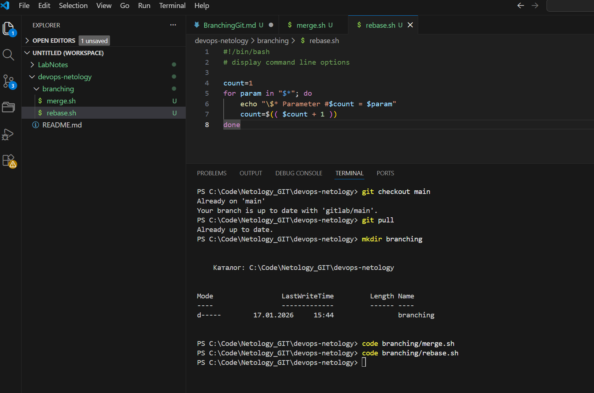

- Фиксируем изменения
`git add branching/`
`git commit -m "prepare for merge and rebase"`
`git push origin main`

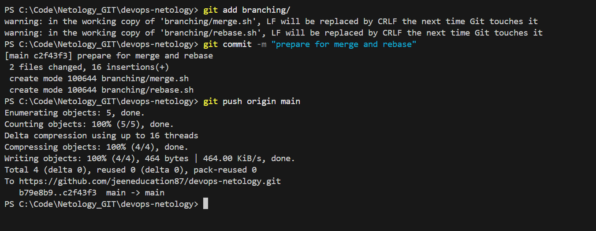

### Ветка git-merge

- Создаем ветку

`git checkout -b git-merge`

- Открываем branching/merge.sh и меняем "$*" на "$@" и echo "\$* ..." на echo "\$@ ...":

- Коммит изменений:

`git add branching/merge.sh`
`git commit -m "merge: @ instead *"`
`git push origin git-merge`

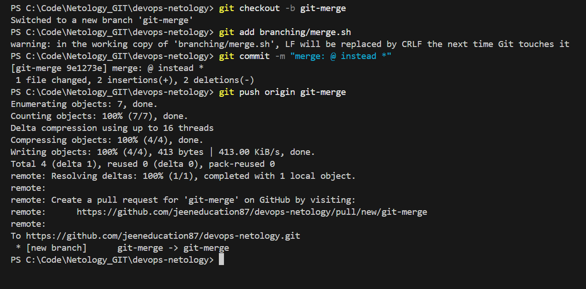

- Снова меняем branching/merge.sh:

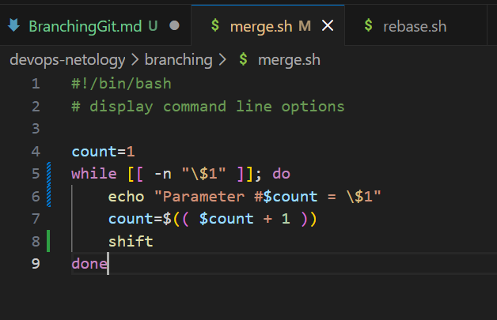
 

- Коммит изменений:
 
`git add branching/merge.sh`
`git commit -m "merge: use shift"`
`git push origin git-merge`

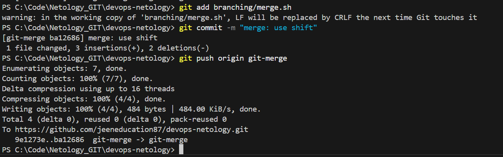

###  Изменение main

- Возвращаемся в main:

`git checkout main`

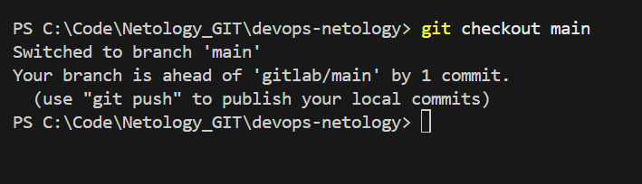

- Меняем файл branching/rebase.sh:

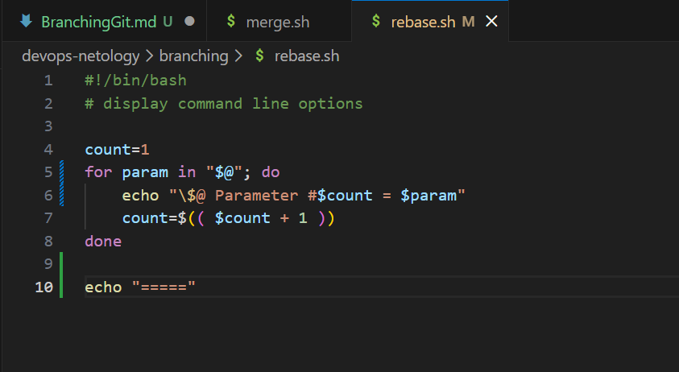  

- Коммит изменений:

`git add branching/rebase.sh`
`git commit -m "update rebase.sh in main"`
`git push origin main`

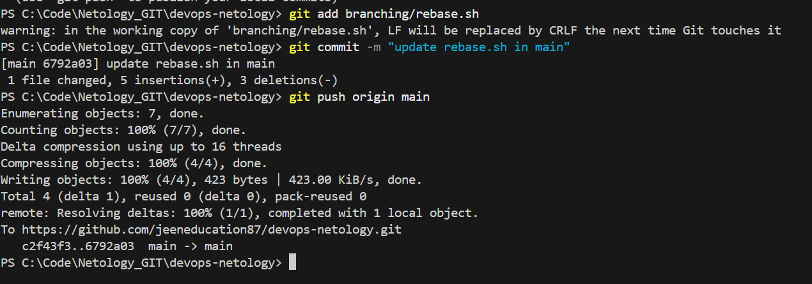

### Ветка git-rebase

- Ищем хеш коммита "prepare for merge and rebase":
     
`git log --oneline`

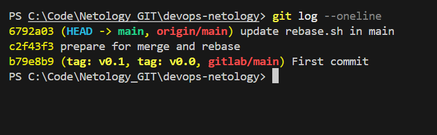

- Переключаемся на хеш (c2f43f3, который стоит напротив сообщения "prepare for merge and rebase") и создаем ветку:
    
`git checkout c2f43f3`
`git checkout -b git-rebase`

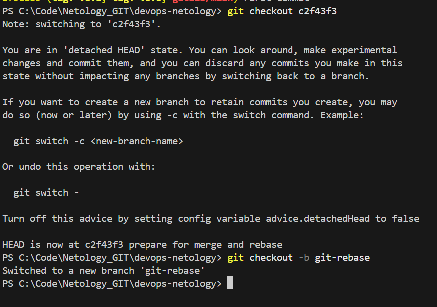

- Меняем branching/rebase.sh:

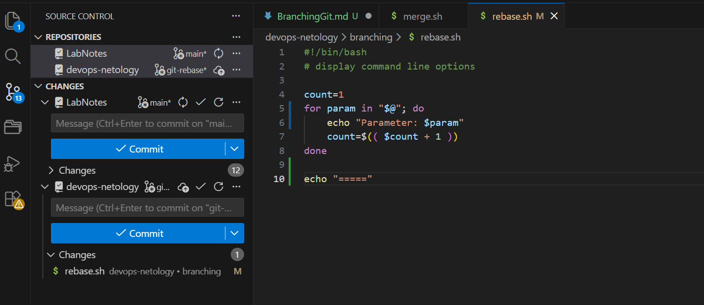

- Коммит изменений:
     
`git add branching/rebase.sh`
`git commit -m "git-rebase 1"`

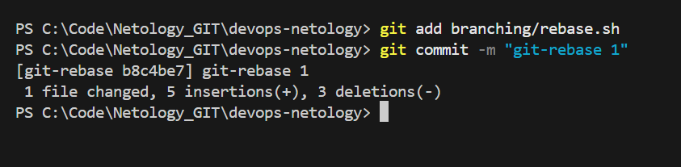

- Снова меняем branching/rebase.sh (меняем echo внутри цикла на echo "Next parameter: $param"):

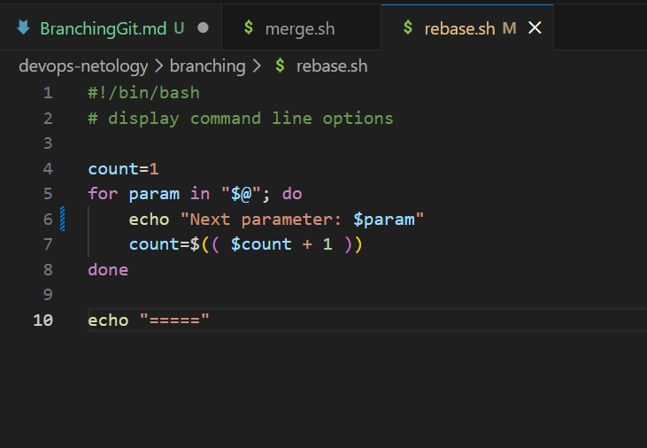

- Коммит изменений:
     
`git add branching/rebase.sh`
`git commit -m "git-rebase 2"`
`git push -u origin git-rebase`

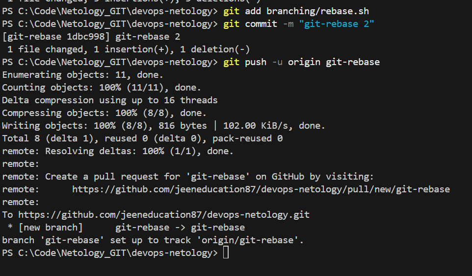

- Смотрим что получили в репозитории GitHub (Network):

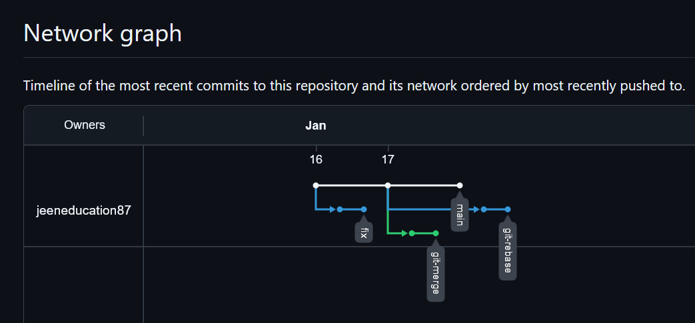

### Merge (слияние)

- Переходим в main и сливаем ветку git-merge:
    
`git checkout main`
`git merge git-merge`
`git push origin main`

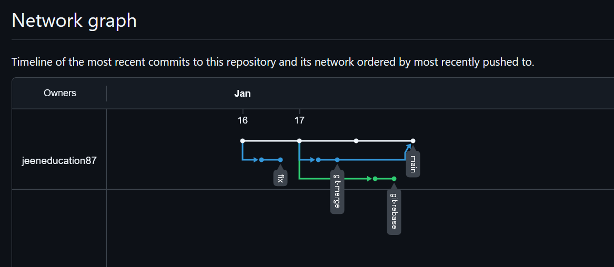

### Rebase

- Переходим в ветку git-rebase:

`git checkout git-rebase`

- Запускаем интерактивный rebase на main:

`git rebase -i main`

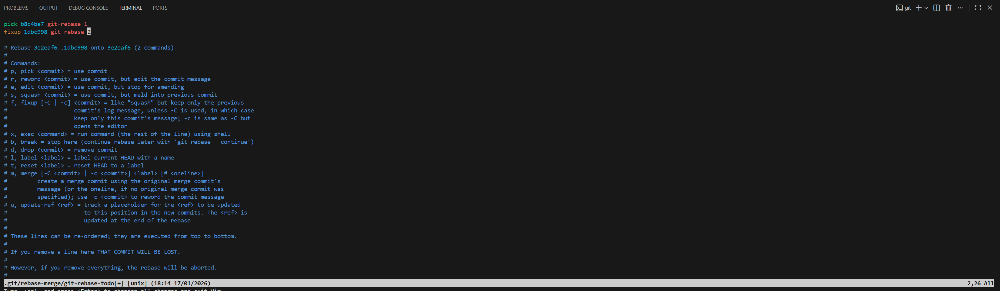

- Видим конфликт №1:

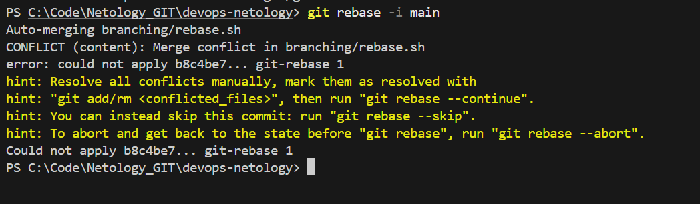

- Оставляем echo "\$@ Parameter #$count = $param"

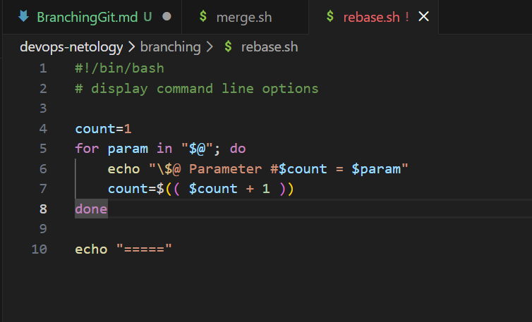

   
`git add branching/rebase.sh`
`git rebase --continue`

- Конфликт №2: Снова конфликт. Оставляем строку echo "Next parameter: $param" :

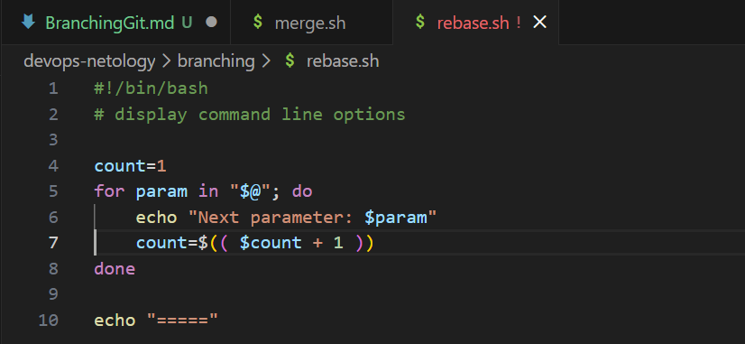     

`git add branching/rebase.sh`
`git rebase --continue`

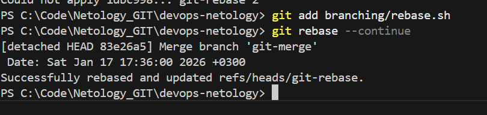

- Push с силой (-f): Обычный push не сработает, так как мы переписали историю.

`git push -u origin git-rebase -f`

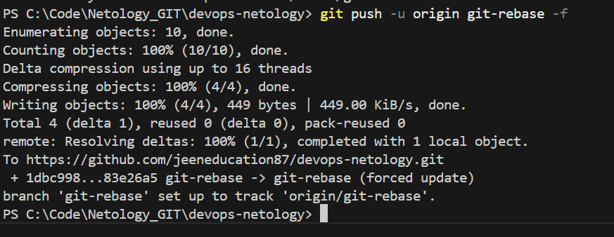

### Финальное слияние

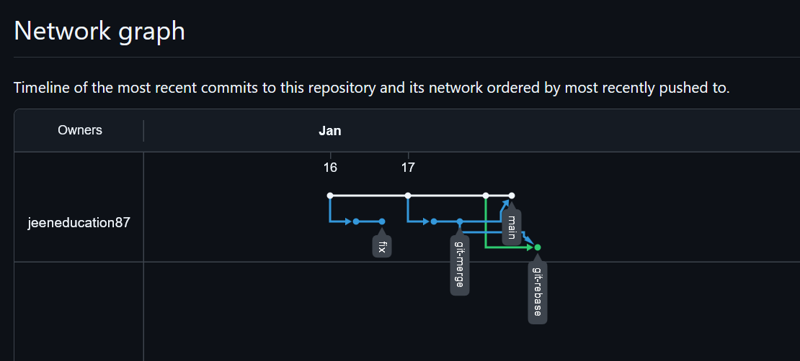

`git checkout main`
`git merge git-rebase`
`git push`

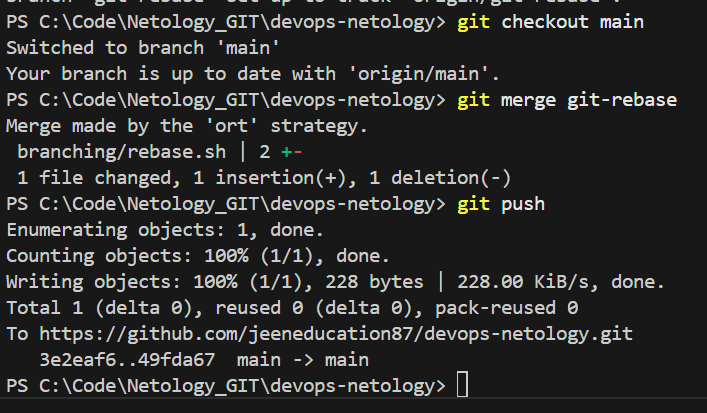

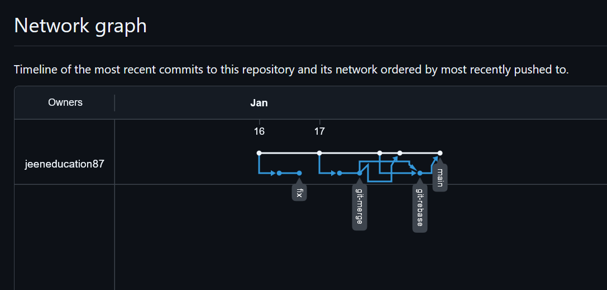

Ссылки на репозиторий: 
[GitHub](https://github.com/jeeneducation87/devops-netology/tree/main)
