# Домашнее задание к занятию "`«Что такое DevOps. СI/СD»`" - `Платонов Станислав`


### Инструкция по выполнению домашнего задания

   1. Сделайте `fork` [репозитория c шаблоном решения](https://github.com/netology-code/sys-pattern-homework) к себе в GitHub и переименуйте его по названию или номеру занятия, например, https://github.com/имя-вашего-репозитория/gitlab-hw или https://github.com/имя-вашего-репозитория/8-03-hw.
   2. Выполните клонирование этого репозитория к себе на ПК с помощью команды `git clone`.
   3. Выполните домашнее задание и заполните у себя локально этот файл README.md:
      - впишите сверху название занятия, ваши фамилию и имя;
      - в каждом задании добавьте решение в требуемом виде — текст, код, скриншоты, ссылка.
      - для корректного добавления скриншотов используйте [инструкцию «Как вставить скриншот в шаблон с решением»](https://github.com/netology-code/sys-pattern-homework/blob/main/screen-instruction.md);
      - при оформлении используйте возможности языка разметки md. Коротко об этом можно посмотреть в [инструкции  по MarkDown](https://github.com/netology-code/sys-pattern-homework/blob/main/md-instruction.md).
   4. После завершения работы над домашним заданием сделайте коммит `git commit -m "comment"` и отправьте его на GitHub `git push origin`.
   5. Для проверки домашнего задания в личном кабинете прикрепите и отправьте ссылку на решение в виде md-файла в вашем GitHub.
   6. Любые вопросы по выполнению заданий задавайте в чате учебной группы или в разделе «Вопросы по заданию» в личном кабинете.
   
Желаем успехов в выполнении домашнего задания!

---

### Задание 1

**Что нужно сделать:**

1. Установите себе jenkins по инструкции из лекции или любым другим способом из официальной документации. Использовать Docker в этом задании нежелательно.
2. Установите на машину с jenkins [golang](https://golang.org/doc/install).
3. Используя свой аккаунт на GitHub, сделайте себе форк [репозитория](https://github.com/netology-code/sdvps-materials.git). В этом же репозитории находится [дополнительный материал для выполнения ДЗ](https://github.com/netology-code/sdvps-materials/blob/main/CICD/8.2-hw.md).
3. Создайте в jenkins Freestyle Project, подключите получившийся репозиторий к нему и произведите запуск тестов и сборку проекта ```go test .``` и  ```docker build .```.

В качестве ответа пришлите скриншоты с настройками проекта и результатами выполнения сборки.

### Решение 1

- Установка Java 

```python
sudo apt-get install default-jre
```

Устанавливаем Jenkins

```python
curl -fsSL https://pkg.jenkins.io/debian-stable/jenkins.io-2023.key |
sudo tee \
/usr/share/keyrings/jenkins-keyring.asc > /dev/null
echo deb [signed-by=/usr/share/keyrings/jenkins-keyring.asc] \
https://pkg.jenkins.io/debian-stable binary/ | sudo tee \
/etc/apt/sources.list.d/jenkins.list > /dev/null
sudo apt-get update
sudo apt-get install jenkins
```

Запускаем и проверяем статус Jenkins

```python
sudo systemctl start jenkins
sudo systemctl status jenkins
```
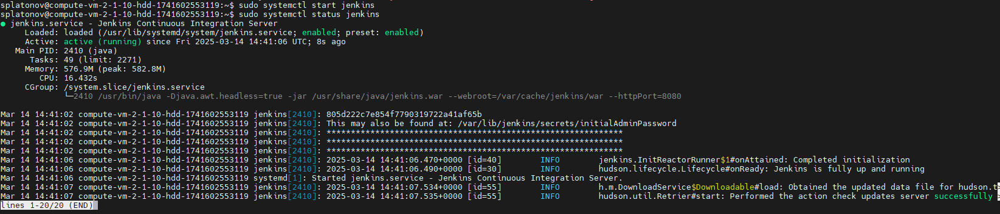

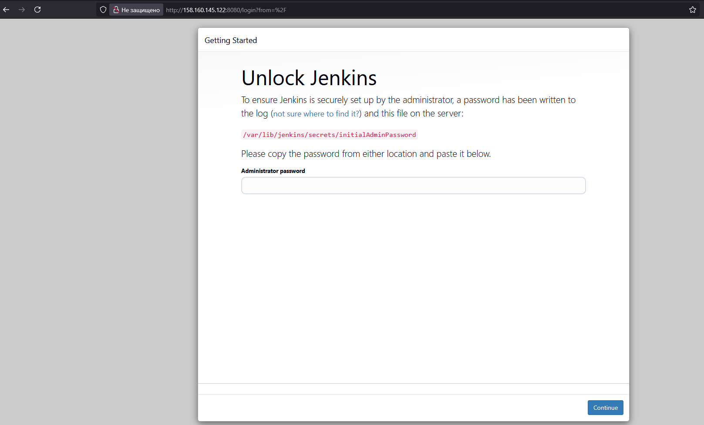

- Устанавливаем go

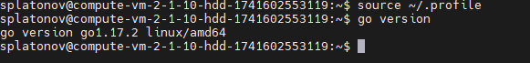

Проверяем, что go доступен для jenkins


- Делаем форк репозитория в свой аккаунт на GitHub
https://github.com/jeeneducation87/sdvps-materials

- Создаем в jenkins проект MyAwsomeProject
Добавляем репозиторий и указываем ветку main

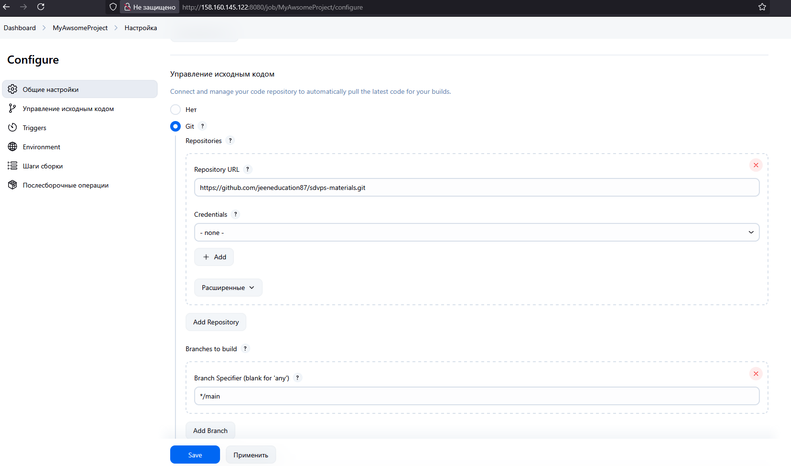

Настраиваем шаги сборки

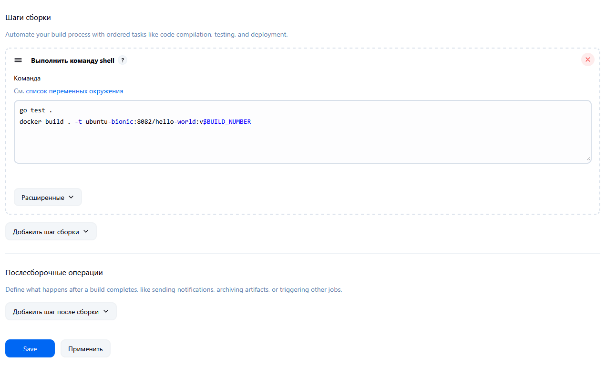

Запускаем сборку

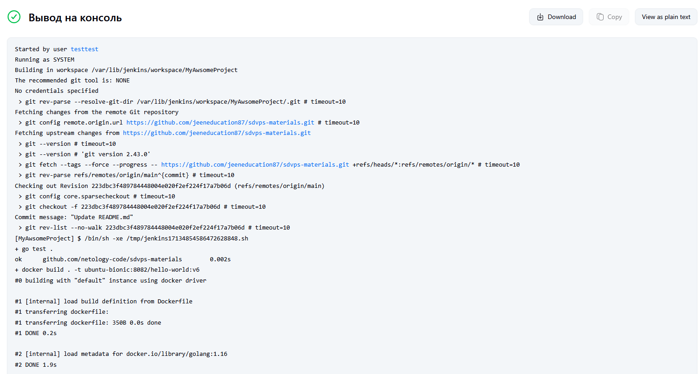
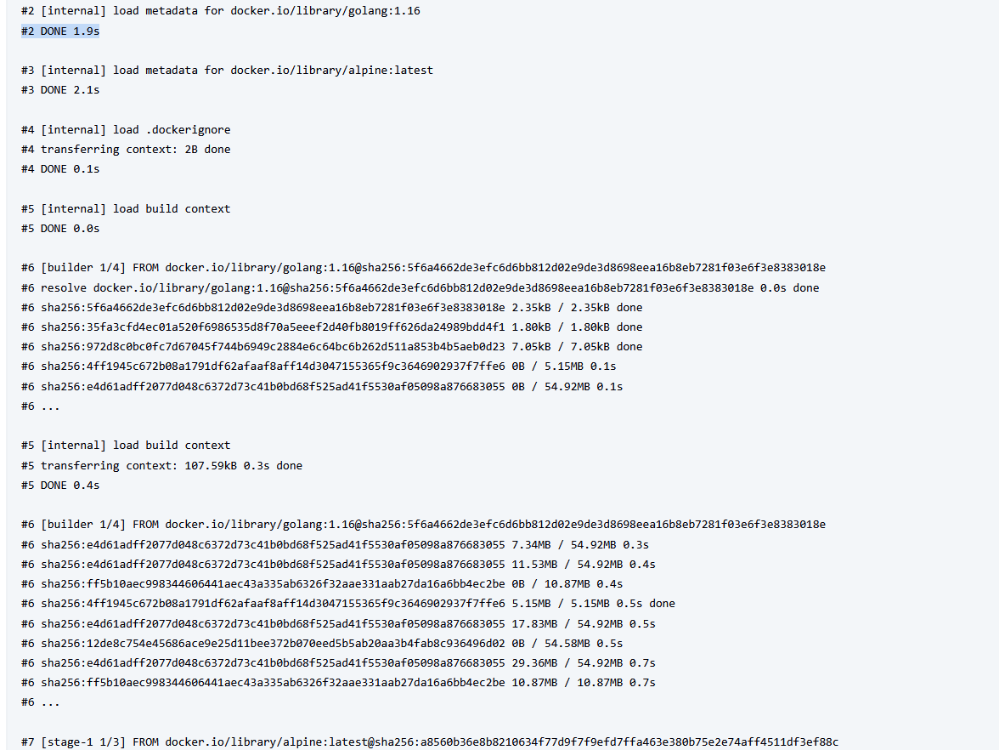
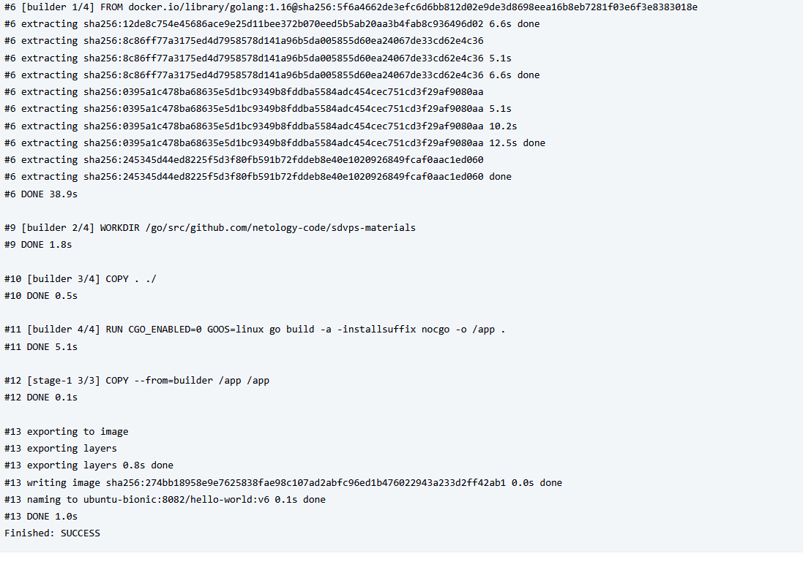

---

### Задание 2

**Что нужно сделать:**

1. Создайте новый проект pipeline.
2. Перепишите сборку из задания 1 на declarative в виде кода.

В качестве ответа пришлите скриншоты с настройками проекта и результатами выполнения сборки.

### Решение 2

Код pipline

```java
pipeline {
 agent any
 stages {
  stage('Git') {
   steps {git branch: 'main', url: 'https://github.com/jeeneducation87/sdvps-materials.git'}
  }
  stage('Test') {
   steps {
    sh 'go test .'
   }
  }
  stage('Build') {
   steps {
    sh 'docker build . -t ubuntu-bionic:8082/hello-world:v$BUILD_NUMBER'
   }
 }
}
}
```

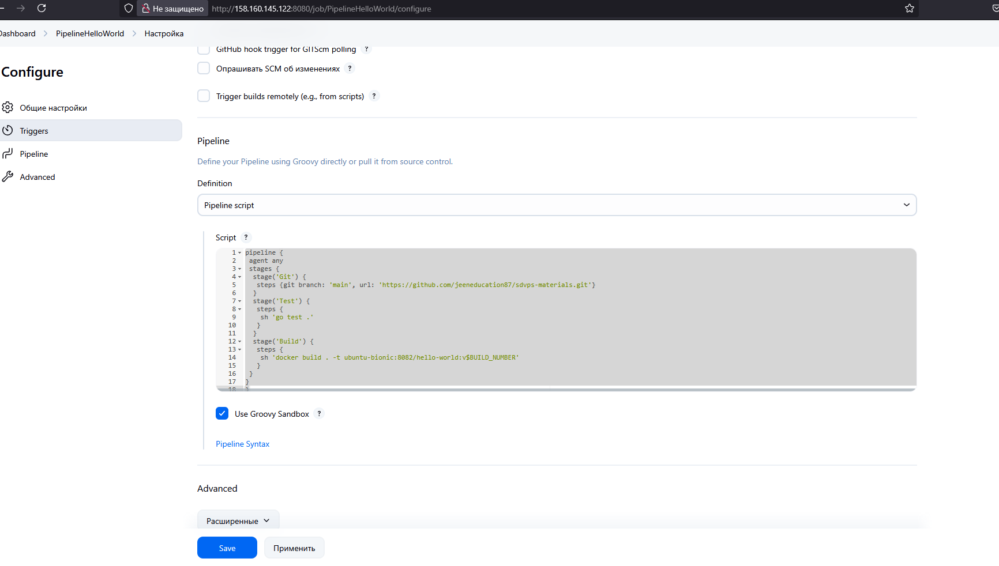

Вывод результата сборки

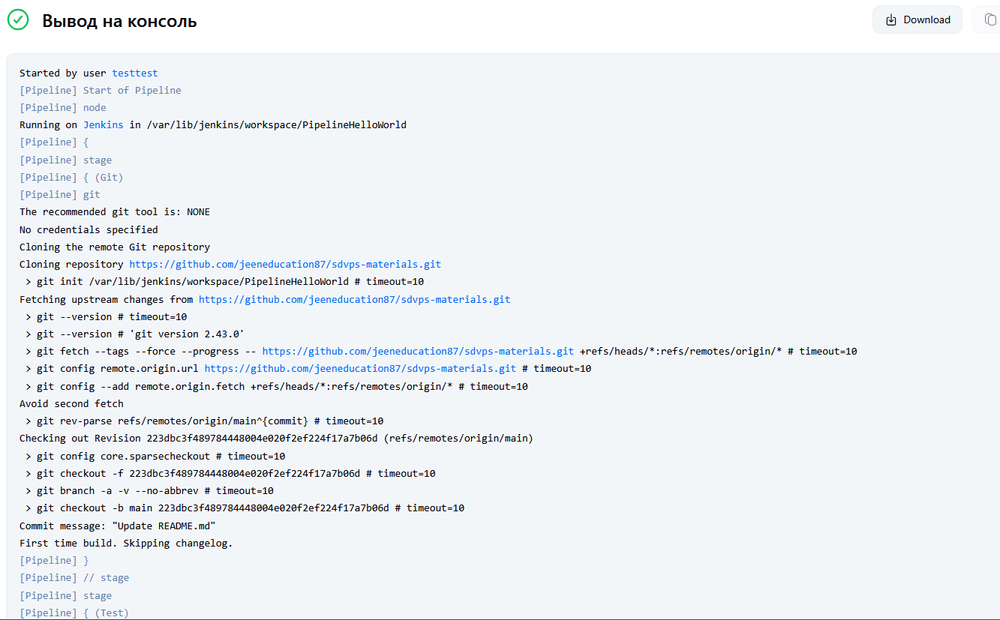
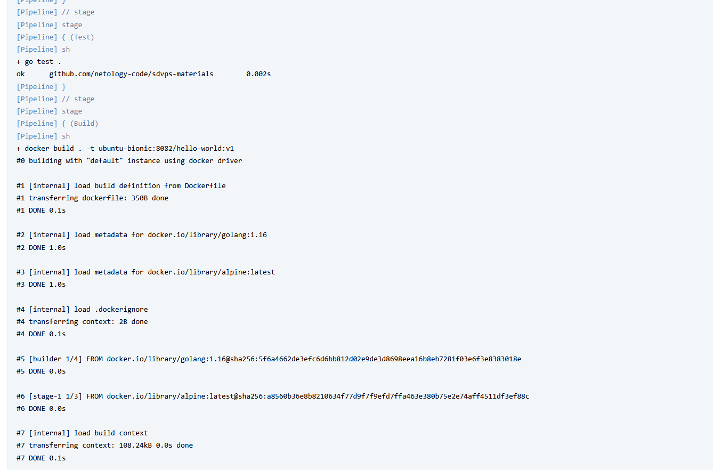
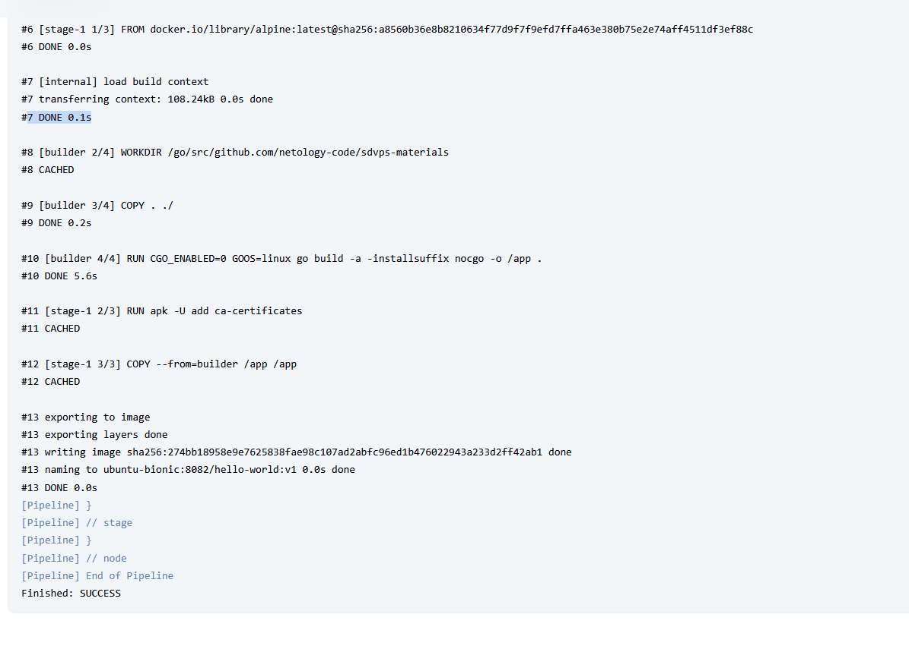

---

### Задание 3

**Что нужно сделать:**

1. Установите на машину Nexus.
1. Создайте raw-hosted репозиторий.
1. Измените pipeline так, чтобы вместо Docker-образа собирался бинарный go-файл. Команду можно скопировать из Dockerfile.
1. Загрузите файл в репозиторий с помощью jenkins.

В качестве ответа пришлите скриншоты с настройками проекта и результатами выполнения сборки.

### Решение 3

- Установил Nexus
Создал пользователя
Настроил raw-hosted репозиторий

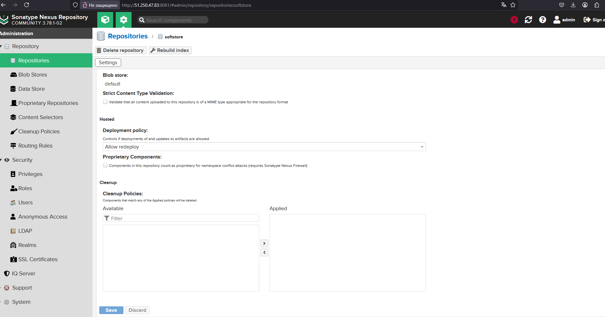

```python
pipeline {
 agent any
 stages {
  stage('Git') {
   steps {git branch: 'main', url: 'https://github.com/jeeneducation87/sdvps-materials.git'}
  }
  stage('Test') {
   steps {
    sh 'go test .'
   }
  }
  stage('Build') {
   steps {
    sh 'go build -a -installsuffix nocgo -o app/app_go_v$BUILD_NUMBER .'
   }
   }
   stage('Upload') {
   steps {
    sh 'curl http://51.250.47.83:8081/repository/softstore/ --upload-file app/app_go_v$BUILD_NUMBER -v -u "admin:admin64efh097"'   }
  }
}
}
```
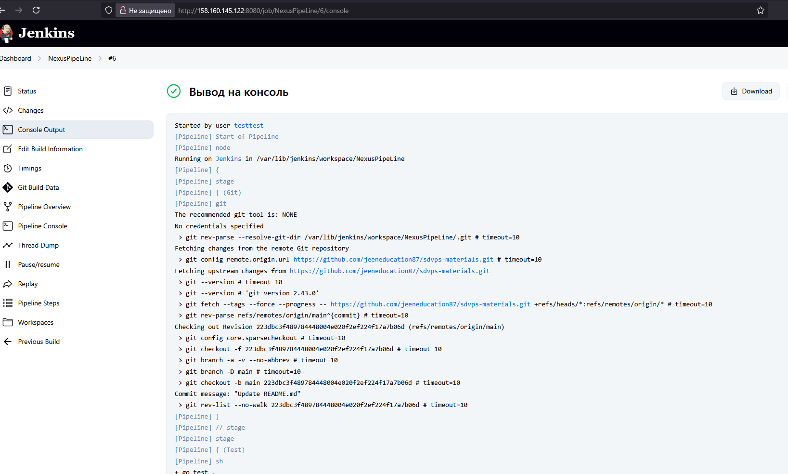
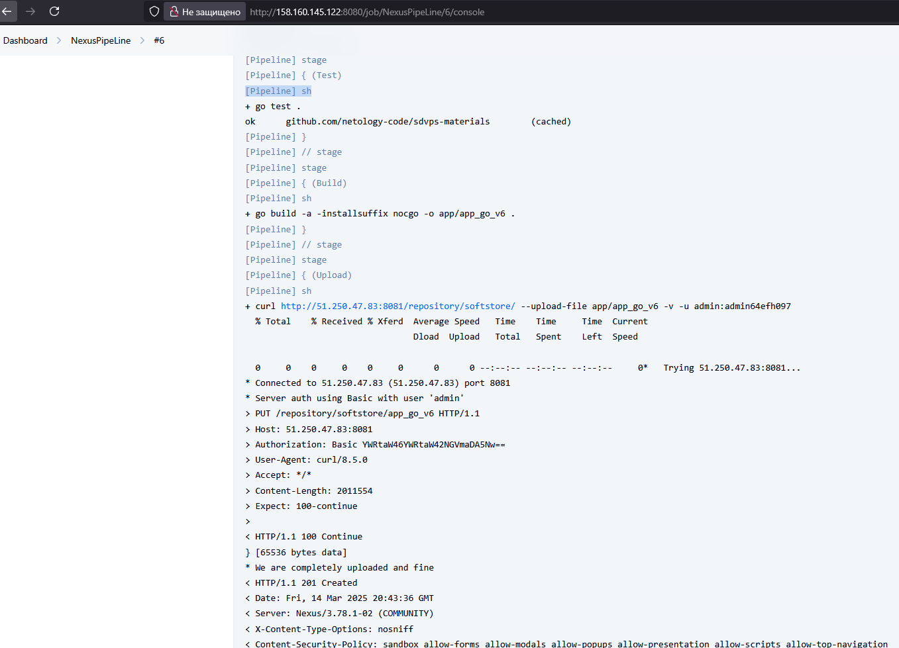
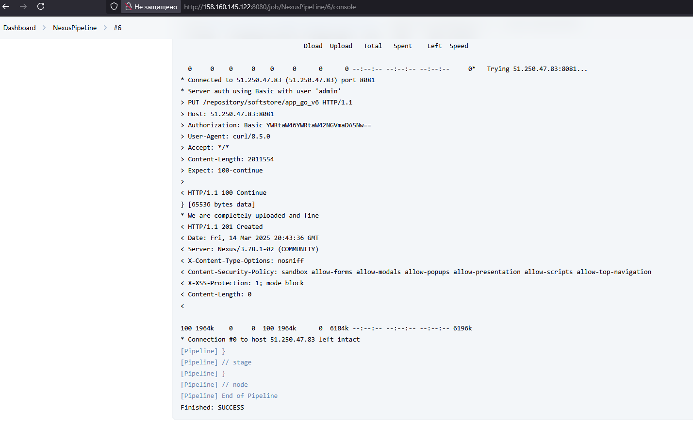

Приложение собрано и доставлено в репозиторий

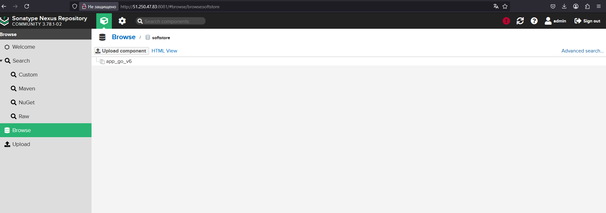 


---