# Домашнее задание к занятию 4 «Оркестрация группой Docker контейнеров на примере Docker Compose»

## Задача 1

Сценарий выполнения задачи:
- Установите docker и docker compose plugin на свою linux рабочую станцию или ВМ.
- Если dockerhub недоступен создайте файл /etc/docker/daemon.json с содержимым: ```{"registry-mirrors": ["https://mirror.gcr.io", "https://daocloud.io", "https://c.163.com/", "https://registry.docker-cn.com"]}```
- Зарегистрируйтесь и создайте публичный репозиторий  с именем "custom-nginx" на https://hub.docker.com (ТОЛЬКО ЕСЛИ У ВАС ЕСТЬ ДОСТУП);
- скачайте образ nginx:1.29.0;
- Создайте Dockerfile и реализуйте в нем замену дефолтной индекс-страницы(/usr/share/nginx/html/index.html), на файл index.html с содержимым:
```
<html>
<head>
Hey, Netology
</head>
<body>
<h1>I will be DevOps Engineer!</h1>
</body>
</html>
```
- Соберите и отправьте созданный образ в свой dockerhub-репозитории c tag 1.0.0 (ТОЛЬКО ЕСЛИ ЕСТЬ ДОСТУП). 
- Предоставьте ответ в виде ссылки на https://hub.docker.com/<username_repo>/custom-nginx/general .

## Решение 1

- Установка Docker:
   
`sudo apt-get update`
`sudo apt-get install ca-certificates curl gnupg`
`sudo install -m 0755 -d /etc/apt/keyrings`
`curl -fsSL https://download.docker.com/linux/ubuntu/gpg | sudo gpg --dearmor -o /etc/apt/keyrings/docker.gpg`
`sudo chmod a+r /etc/apt/keyrings/docker.gpg`
>echo \
>  "deb [arch="$(dpkg --print-architecture)" signed-by=/etc/apt/keyrings/docker.gpg] https://download.docker.com/linux/ubuntu \
>  "$(. /etc/os-release && echo "$VERSION_CODENAME")" stable" | \
>  sudo tee /etc/apt/sources.list.d/docker.list > /dev/null
`sudo apt-get update`
`sudo apt-get install docker-ce docker-ce-cli containerd.io docker-buildx-plugin docker-compose-plugin`

- Настройка зеркал (daemon.json):
     
`sudo nano /etc/docker/daemon.json`

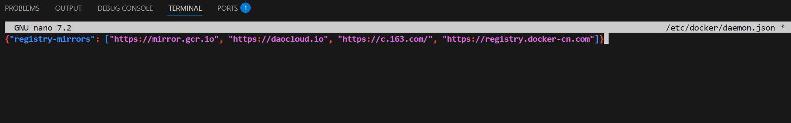    

`sudo systemctl restart docker`

- Создание Dockerfile:

`mkdir task1 && cd task1`
`nano index.html`

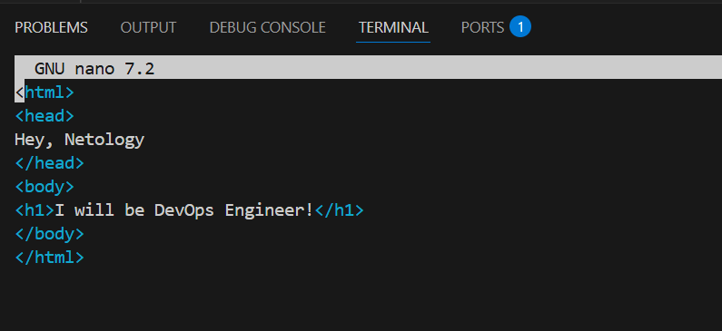
    
`nano Dockerfile`

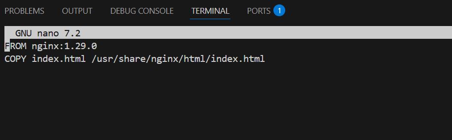

    
`docker build -t custom-nginx:1.0.0 .`

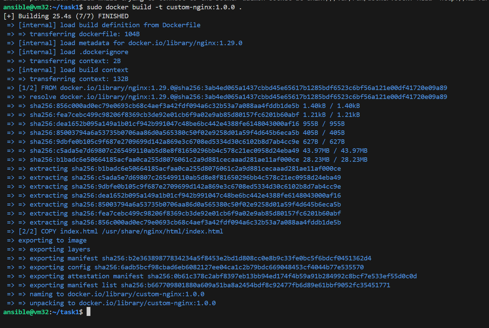


## Задача 2
1. Запустите ваш образ custom-nginx:1.0.0 командой docker run в соответвии с требованиями:
- имя контейнера "ФИО-custom-nginx-t2"
- контейнер работает в фоне
- контейнер опубликован на порту хост системы 127.0.0.1:8080
2. Не удаляя, переименуйте контейнер в "custom-nginx-t2"
3. Выполните команду ```date +"%d-%m-%Y %T.%N %Z" ; sleep 0.150 ; docker ps ; ss -tlpn | grep 127.0.0.1:8080  ; docker logs custom-nginx-t2 -n1 ; docker exec -it custom-nginx-t2 base64 /usr/share/nginx/html/index.html```
4. Убедитесь с помощью curl или веб браузера, что индекс-страница доступна.

В качестве ответа приложите скриншоты консоли, где видно все введенные команды и их вывод.


## Решение 2

- Запуск контейнера:
   
`sudo docker run -d --name splatonov-custom-nginx-t2 -p 127.0.0.1:8080:80 custom-nginx:1.0.0`

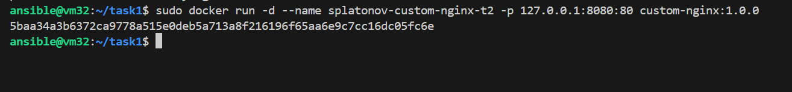

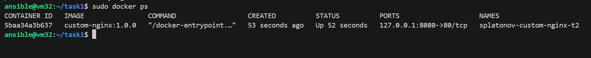

- Переименование:

`sudo docker rename splatonov-custom-nginx-t2 custom-nginx-t2`

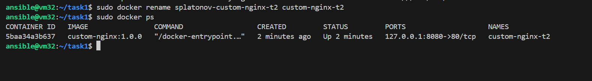

- Проверка:
     
`date +"%d-%m-%Y %T.%N %Z" ; sleep 0.150 ; docker ps ; ss -tlpn | grep 127.0.0.1:8080  ; docker logs custom-nginx-t2 -n1 ; docker exec -it custom-nginx-t2 base64 /usr/share/nginx/html/index.html`

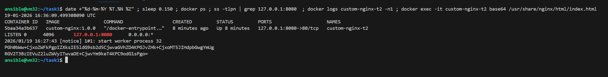

- Проверка доступности:
     
`curl http://127.0.0.1:8080`

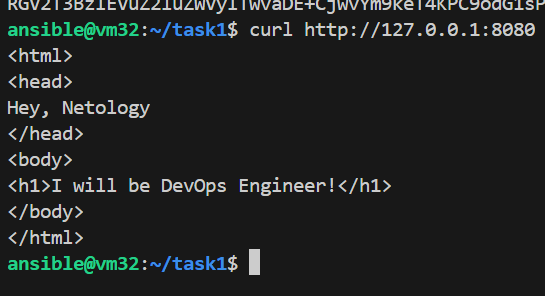


## Задача 3
1. Воспользуйтесь docker help или google, чтобы узнать как подключиться к стандартному потоку ввода/вывода/ошибок контейнера "custom-nginx-t2".
2. Подключитесь к контейнеру и нажмите комбинацию Ctrl-C.
3. Выполните ```docker ps -a``` и объясните своими словами почему контейнер остановился.
4. Перезапустите контейнер
5. Зайдите в интерактивный терминал контейнера "custom-nginx-t2" с оболочкой bash.
6. Установите любимый текстовый редактор(vim, nano итд) с помощью apt-get.
7. Отредактируйте файл "/etc/nginx/conf.d/default.conf", заменив порт "listen 80" на "listen 81".
8. Запомните(!) и выполните команду ```nginx -s reload```, а затем внутри контейнера ```curl http://127.0.0.1:80 ; curl http://127.0.0.1:81```.
9. Выйдите из контейнера, набрав в консоли  ```exit``` или Ctrl-D.
10. Проверьте вывод команд: ```ss -tlpn | grep 127.0.0.1:8080``` , ```docker port custom-nginx-t2```, ```curl http://127.0.0.1:8080```. Кратко объясните суть возникшей проблемы.
11. * Это дополнительное, необязательное задание. Попробуйте самостоятельно исправить конфигурацию контейнера, используя доступные источники в интернете. Не изменяйте конфигурацию nginx и не удаляйте контейнер. Останавливать контейнер можно. [пример источника](https://www.baeldung.com/linux/assign-port-docker-container)
12. Удалите запущенный контейнер "custom-nginx-t2", не останавливая его.(воспользуйтесь --help или google)

В качестве ответа приложите скриншоты консоли, где видно все введенные команды и их вывод.

## Решение 3

- Подключение к потоку (Attach):
     
`docker attach custom-nginx-t2`

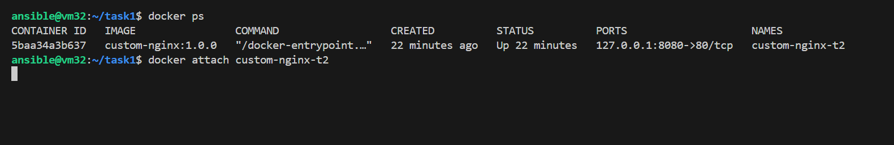

- Нажимаем Ctrl+C:
 
`docker ps -a`

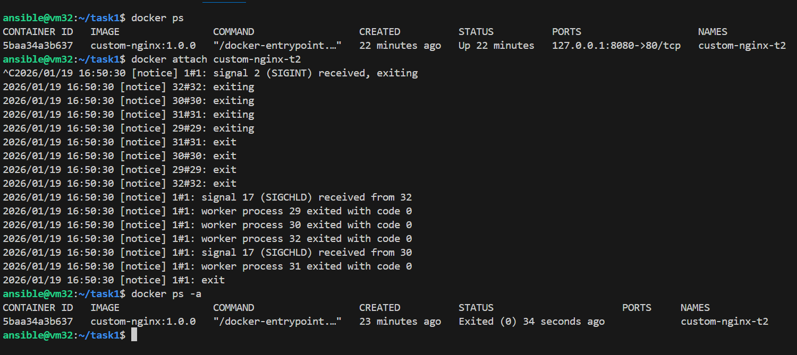

Контейнер остановился, потому что основной процесс nginx получил сигнал завершения (от нажатия Ctrl+C). Команда docker attach привязывает терминал к стандартному вводу/выводу основного процесса.

- Терминал контейнера: 

`docker start custom-nginx-t2`
`docker exec -it custom-nginx-t2 bash`

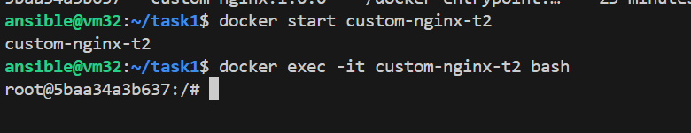
     
`apt-get update && apt-get install -y nano`
`nano /etc/nginx/conf.d/default.conf`

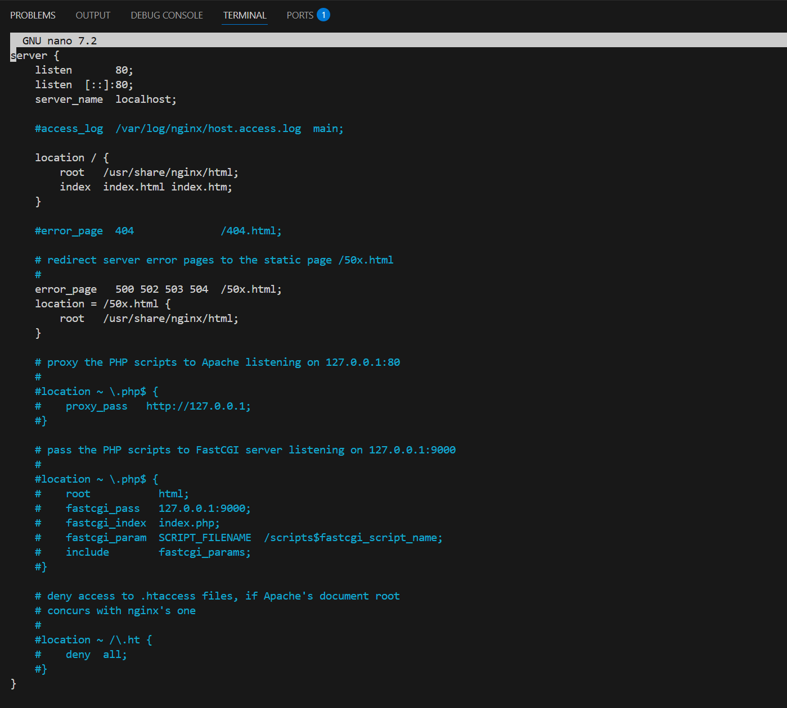

- Меняем listen 80; на listen 81;

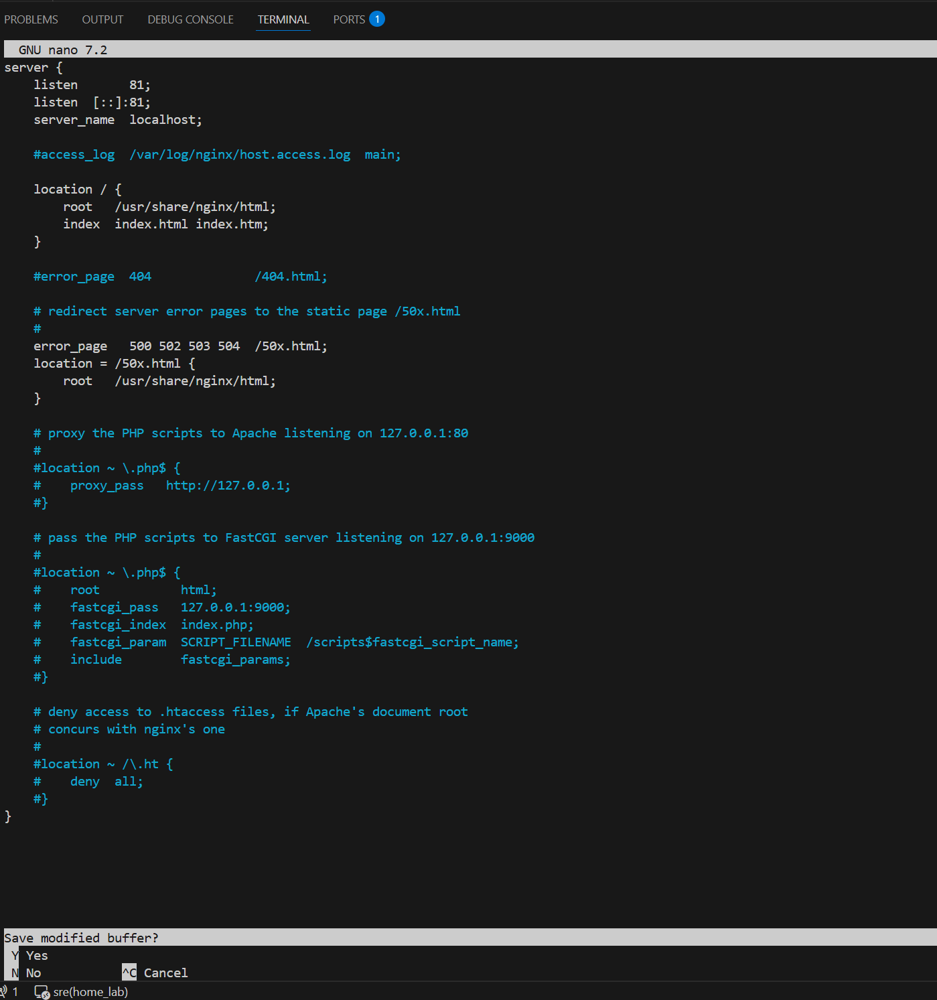

- Применяем настройки и проверяем:
     
`nginx -s reload`
`curl http://127.0.0.1:80`
`curl http://127.0.0.1:81`

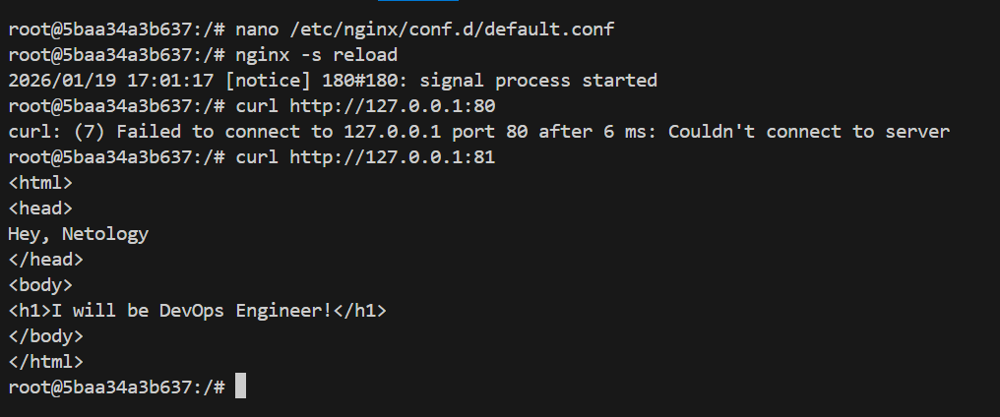

`exit`

- Диагностика проблемы (на хосте):
    
`ss -tlpn | grep 127.0.0.1:8080`
`docker port custom-nginx-t2`
`curl http://127.0.0.1:8080`

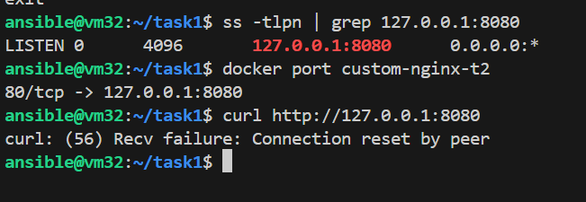

Curl возвращает ошибку (Connection reset) потому что docker пробрасывает хостовый порт 8080 на порт 80 контейнера. Но мы перенастроили Nginx внутри слушать порт 81. Связка разорвана.

- Исправление проблемы:

1. Останавливаем контейнер и докер:

`docker ps`
`docker stop 5baa34a3b637`

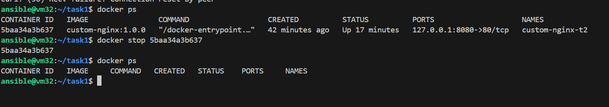

`sudo systemctl stop docker`

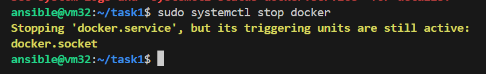

Важно! Нужно также остановить docker.socket и проверить статус, иначе изменения конфигов не удастся применить и докер перепишет их.

`sudo systemctl stop docker docker.socket`

`docker inspect custom-nginx-t2 | grep Id`

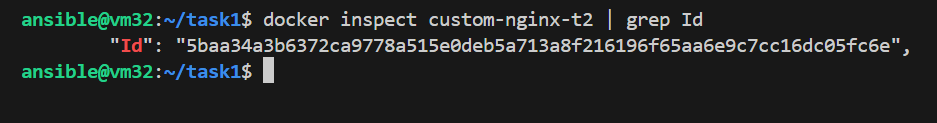

2. Редактируем в директорию конфигурации (/var/lib/docker/containers/5baa34a3b6372ca9778a515e0deb5a713a8f216196f65aa6e9c7cc16dc05fc6e) hostconfig.json и config.v2.json:

hostconfig.json
`sudo nano /var/lib/docker/containers/5baa34a3b6372ca9778a515e0deb5a713a8f216196f65aa6e9c7cc16dc05fc6e/hostconfig.json`
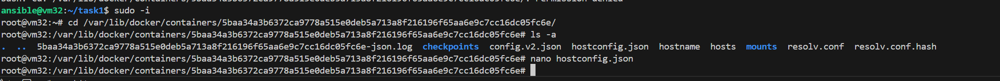

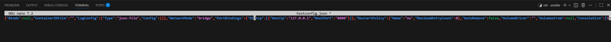

config.v2.json
`sudo nano /var/lib/docker/containers/5baa34a3b6372ca9778a515e0deb5a713a8f216196f65aa6e9c7cc16dc05fc6e/config.v2.json`

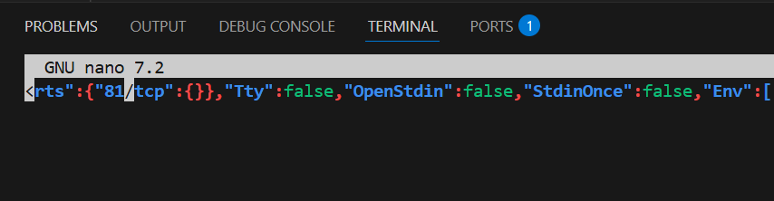

3. Запускаем контейнер и докер:

`sudo systemctl start docker`
`docker start custom-nginx-t2`

Получилось переопределить порт на 81 "на лету":

`curl http://127.0.0.1:8080`

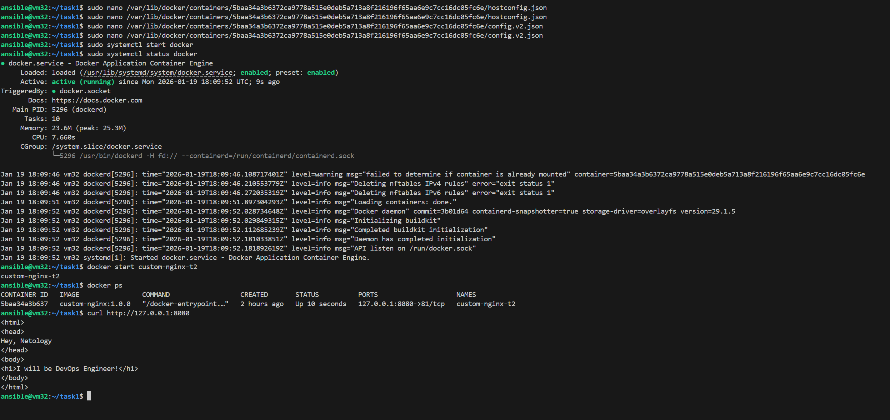

- Удаление:

`docker rm -f custom-nginx-t2`

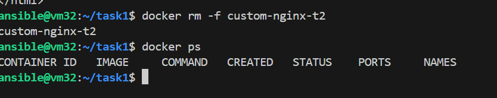


## Задача 4


- Запустите первый контейнер из образа ***centos*** c любым тегом в фоновом режиме, подключив папку  текущий рабочий каталог ```$(pwd)``` на хостовой машине в ```/data``` контейнера, используя ключ -v.
- Запустите второй контейнер из образа ***debian*** в фоновом режиме, подключив текущий рабочий каталог ```$(pwd)``` в ```/data``` контейнера. 
- Подключитесь к первому контейнеру с помощью ```docker exec``` и создайте текстовый файл любого содержания в ```/data```.
- Добавьте ещё один файл в текущий каталог ```$(pwd)``` на хостовой машине.
- Подключитесь во второй контейнер и отобразите листинг и содержание файлов в ```/data``` контейнера.


В качестве ответа приложите скриншоты консоли, где видно все введенные команды и их вывод.


## Решение 4

- Запуск контейнеров с Volume:

     
1. CentOS
    
`docker run -d -v $(pwd):/data centos:7 sleep infinity`

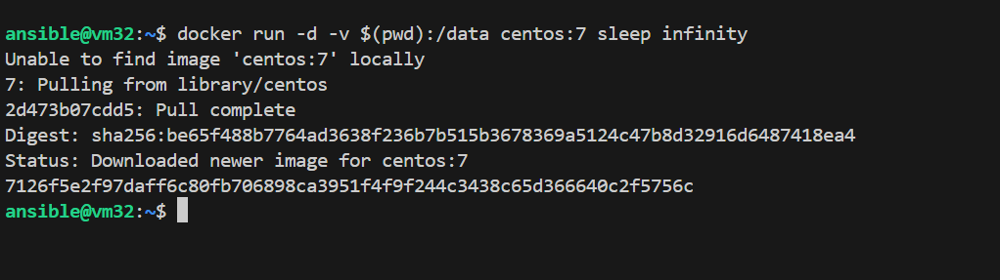

2. Debian
    
`docker run -d -v $(pwd):/data debian:stable sleep infinity`

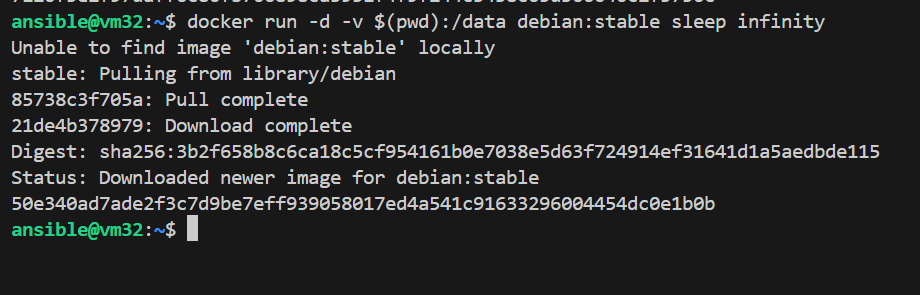

- Создание файлов: 

Узнаем ID контейнера CentOS:    

`docker ps`

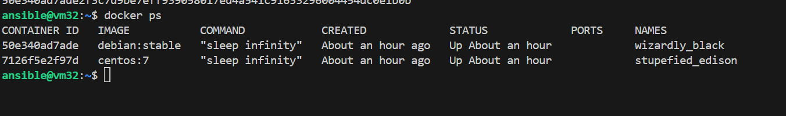

7126f5e2f97d   centos:7

`docker exec -it 7126f5e2f97d sh -c "echo 'Hello from CentOS' > /data/centos_file.txt"`

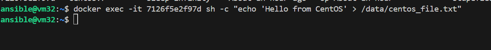

- Создание файла на хосте:
   
`touch host_file.txt`

Узнаем ID контейнера Debian:

50e340ad7ade   debian:stable
     
`docker exec -it 50e340ad7ade ls -la /data`

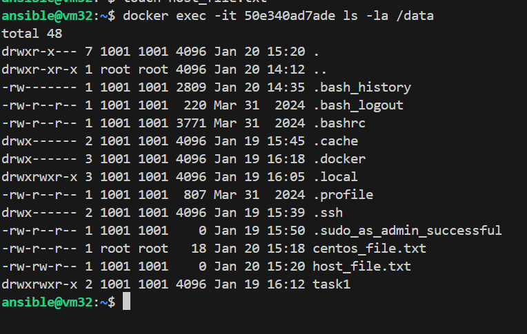

`docker exec -it 50e340ad7ade cat /data/centos_file.txt`

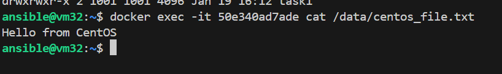

Файлы centos_file.txt, host_file.txt и Dockerfile видно на скриншотах, так как мы монтировали текущую директорию /data к обоим контейнерам.


## Задача 5

1. Создайте отдельную директорию(например /tmp/netology/docker/task5) и 2 файла внутри него.
"compose.yaml" с содержимым:
```
version: "3"
services:
  portainer:
    network_mode: host
    image: portainer/portainer-ce:latest
    volumes:
      - /var/run/docker.sock:/var/run/docker.sock
```
"docker-compose.yaml" с содержимым:
```
version: "3"
services:
  registry:
    image: registry:2

    ports:
    - "5000:5000"
```

И выполните команду "docker compose up -d". Какой из файлов был запущен и почему? (подсказка: https://docs.docker.com/compose/compose-application-model/#the-compose-file )

2. Отредактируйте файл compose.yaml так, чтобы были запущенны оба файла. (подсказка: https://docs.docker.com/compose/compose-file/14-include/)

3. Выполните в консоли вашей хостовой ОС необходимые команды чтобы залить образ custom-nginx как custom-nginx:latest в запущенное вами, локальное registry. Дополнительная документация: https://distribution.github.io/distribution/about/deploying/
4. Откройте страницу "https://127.0.0.1:9000" и произведите начальную настройку portainer.(логин и пароль адмнистратора)
5. Откройте страницу "http://127.0.0.1:9000/#!/home", выберите ваше local  окружение. Перейдите на вкладку "stacks" и в "web editor" задеплойте следующий компоуз:

```
version: '3'

services:
  nginx:
    image: 127.0.0.1:5000/custom-nginx
    ports:
      - "9090:80"
```
6. Перейдите на страницу "http://127.0.0.1:9000/#!/2/docker/containers", выберите контейнер с nginx и нажмите на кнопку "inspect". В представлении <> Tree разверните поле "Config" и сделайте скриншот от поля "AppArmorProfile" до "Driver".

7. Удалите любой из манифестов компоуза(например compose.yaml).  Выполните команду "docker compose up -d". Прочитайте warning, объясните суть предупреждения и выполните предложенное действие. Погасите compose-проект ОДНОЙ(обязательно!!) командой.

В качестве ответа приложите скриншоты консоли, где видно все введенные команды и их вывод, файл compose.yaml , скриншот portainer c задеплоенным компоузом.

## Решение 5

- Подготовка файлов:

`mkdir -p /tmp/netology/docker/task5 && cd /tmp/netology/docker/task5`

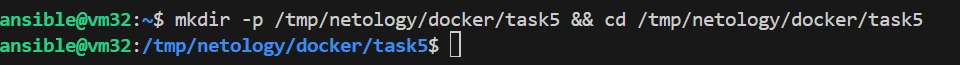

Создаем compose.yaml и docker-compose.yaml с содержимым.

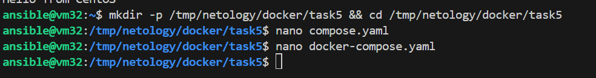
 
`docker compose up -d`
`docker compose ps`

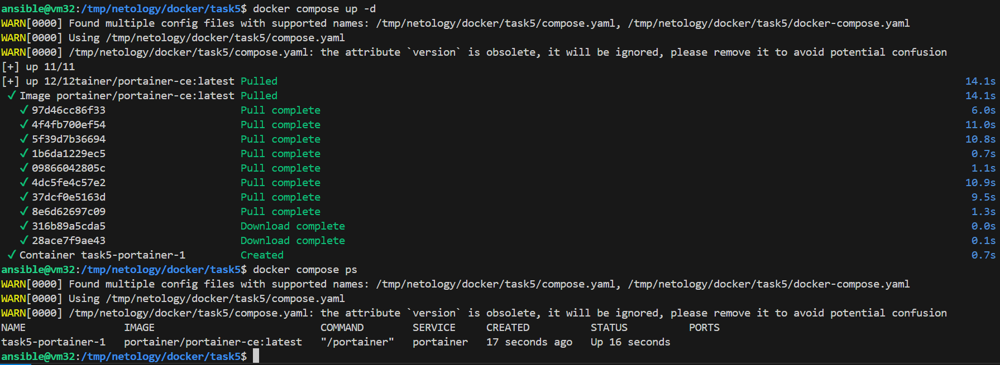

Будет запущен compose.yaml (Portainer). Согласно спецификации Docker Compose v2, файл compose.yaml является предпочтительным и используется по умолчанию, если найден. 
Файл docker-compose.yaml игнорируется при наличии первого. Warning на скриншоте об этом сообщает.

- Редактирование compose.yaml для запуска обоих файлов (Include):
    
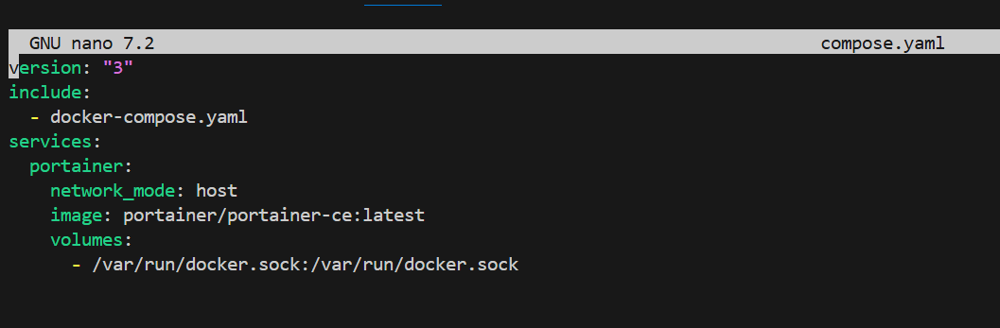

`docker compose up -d`

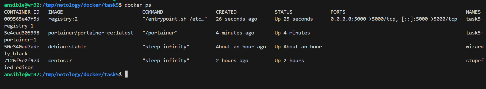

Запустились оба файла compose.yaml и docker-compose.yaml

- Локальный Registry: 

Тегируем и пушим образ из первой задачи:
     
`docker tag custom-nginx:1.0.0 localhost:5000/custom-nginx:latest`
`docker push localhost:5000/custom-nginx:latest`

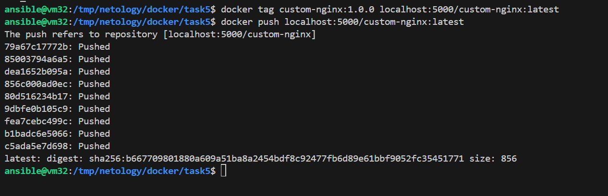

- Portainer и Deploy:
Открываем UI Portainer http://192.168.122.32:9000 (настроил HAProxy для доступа до VM c контейнерами)
Создаем админа - Get Started (Local environment).

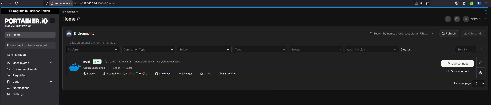


- Deploy compouse (Stacks -> Add stack):

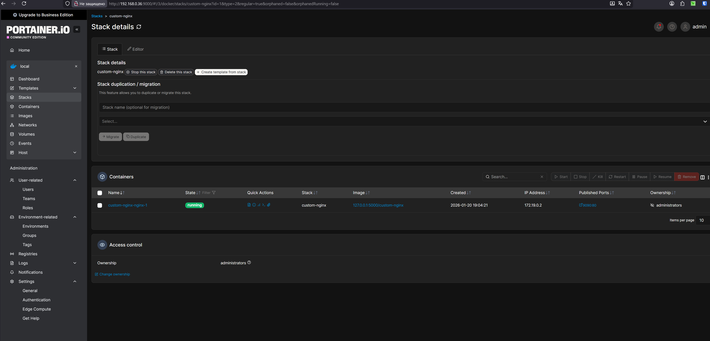

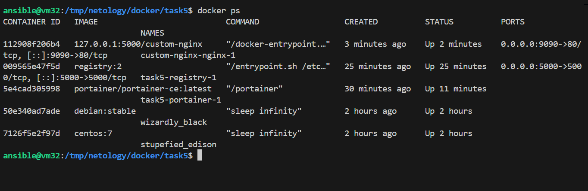
- Инспекция контейнера:


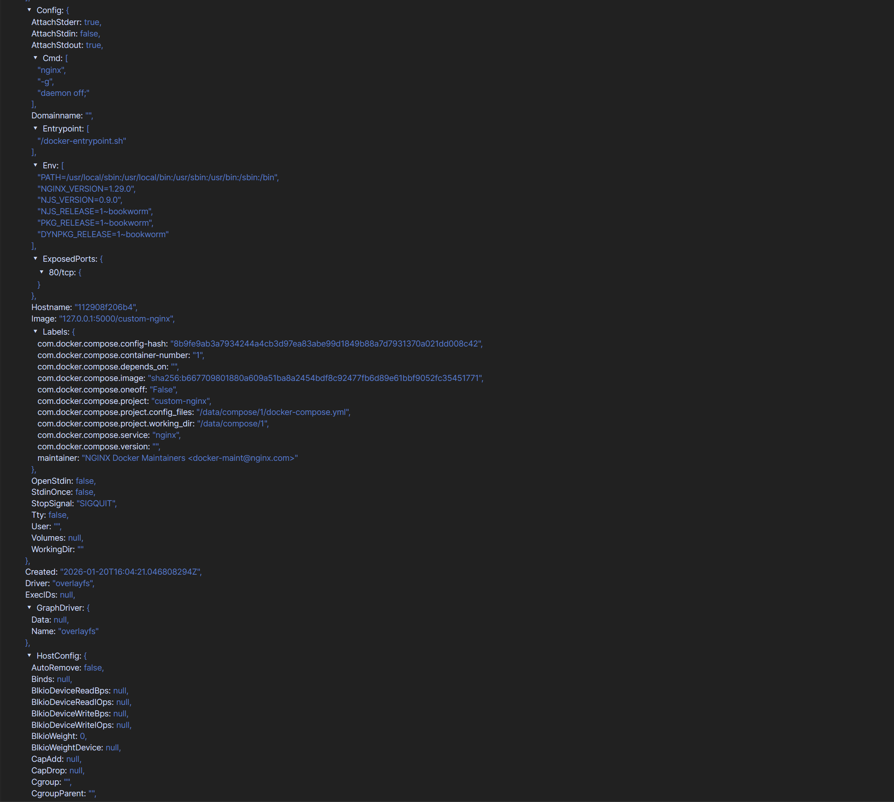

- Warning про Orphans:

Удалиение compose.yaml:

`rm compose.yaml`

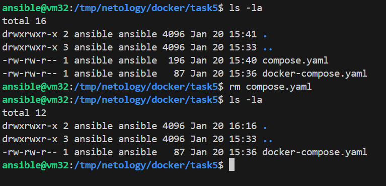

`docker compose up -d`

> WARN[0000] Found orphan containers ([task5-portainer-1]) for this project. If you removed or renamed this service in your compose file, you can run this command with the --remove-orphans flag to clean it up. 

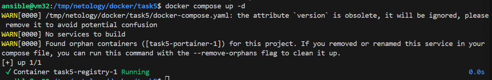

Docker Compose видит запущенные контейнеры, которые принадлежат этому проекту (по названию директории), но не описанные в текущем файле конфигурации (docker-compose.yaml, который остался) и предупреждает, что они "потеряны" - сироты.

`docker compose up -d --remove-orphans`

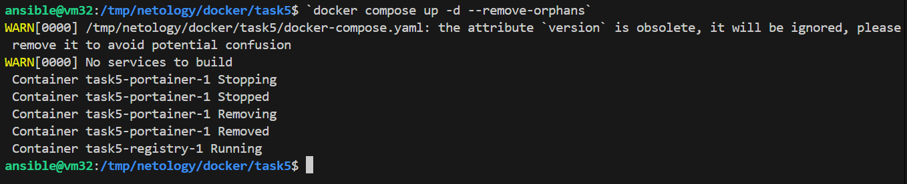

`docker compose down`

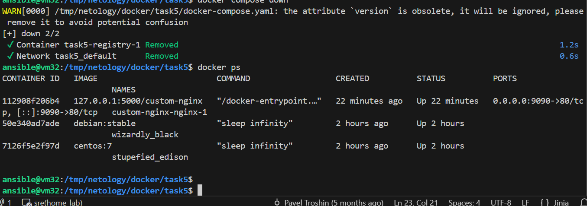

---

