# Домашнее задание к занятию «Основы Git»

### Цель задания

В результате выполнения задания вы:

* научитесь работать с Git, как с распределённой системой контроля версий; 
* сможете создавать и настраивать репозиторий для работы в GitHub, GitLab и Bitbucket; 
* попрактикуетесь работать с тегами;
* поработаете с Git при помощи визуального редактора.

### Чеклист готовности к домашнему заданию

1. Установлена консольная утилита для работы с Git.
2. Есть возможность зарегистрироваться на GitHub, GitLab.
3. Регистрация на Bitbucket не является обязательной. 

### Инструкция к заданию

1. В личном кабинете отправьте на проверку ссылки на ваши репозитории.
2. Любые вопросы по решению задач задавайте в разделе "Вопросы по заданию".

------

## Задание 1. Знакомимся с GitLab и GitHub 

В работе достаточно использовать два репозитория: GitHub и GitLab.

Иногда при работе с Git-репозиториями надо настроить свой локальный репозиторий так, чтобы можно было 
отправлять и принимать изменения из нескольких удалённых репозиториев. 

Это может понадобиться при работе над проектом с открытым исходным кодом, если автор проекта не даёт права на запись в основной репозиторий.

Также некоторые распределённые команды используют такой принцип работы, когда каждый разработчик имеет свой репозиторий, а в основной репозиторий пушатся только конечные результаты 
работы над задачами. 

### Решение 1

- Создаем репозиторий "devops-netology" в GitHub

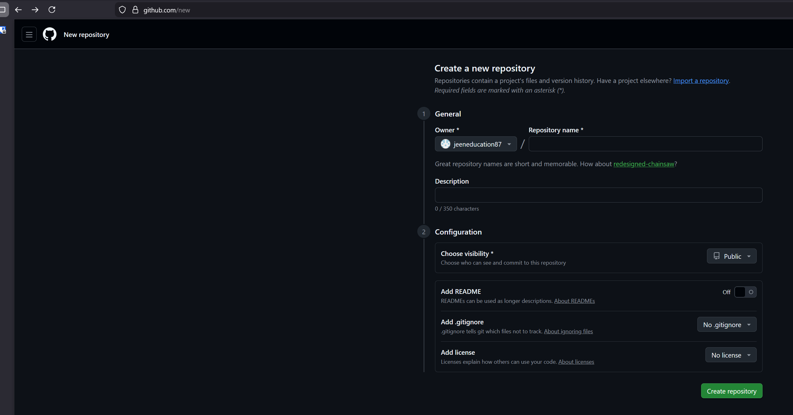

- Создаем проект "devops-netology" в GitLab

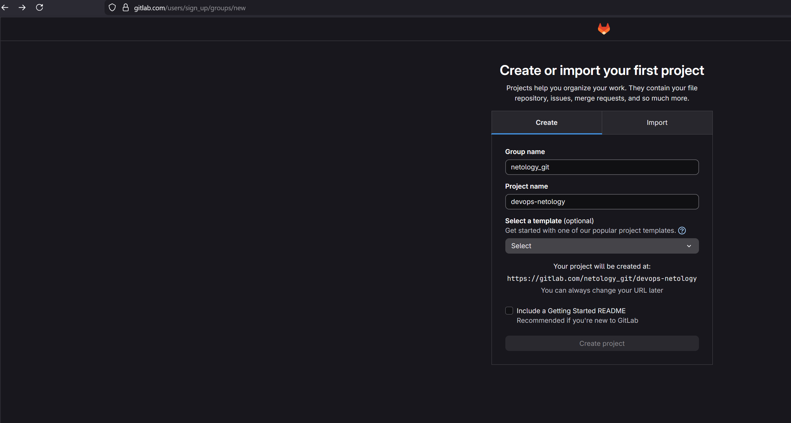

- Создаем файл для проверки
`New-Item -Path "README.md" -ItemType "file" -Value "# Homework DevOps"`
`git add README.md`
`git commit -m "First commit"`

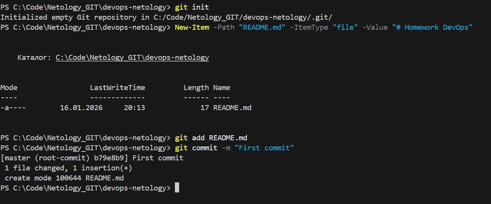

- Подключаем GitHub (как основной origin):
`git remote add origin https://github.com/jeeneducation87/devops-netology.git`
`git branch -M main`
`git push -u origin main`

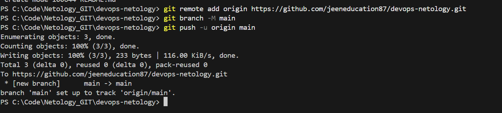

- Подключаем GitLab (как дополнительный gitlab):
`git remote add gitlab https://gitlab.com/netology_git/devops-netology.git`
`git push -u gitlab main`

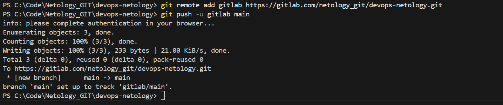

- Проверяем что удаленные репозитории успешно добавлены и файл README.md загружен в оба репозитория:
`git remote -v`

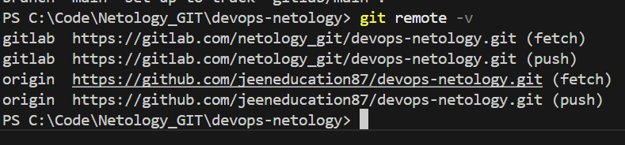

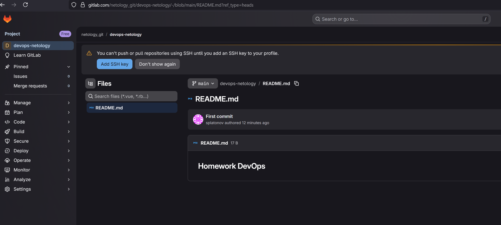

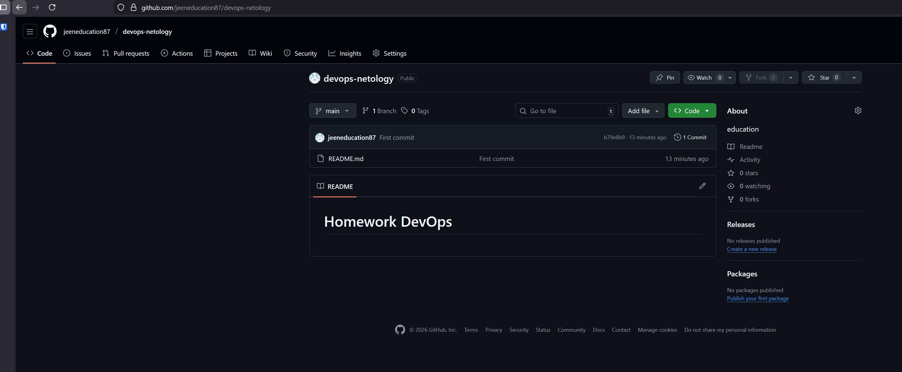

## Задание 2. Теги

Представьте ситуацию, когда в коде была обнаружена ошибка — надо вернуться на предыдущую версию кода,
исправить её и выложить исправленный код в продакшн. Мы никуда не будем выкладывать код, но пометим некоторые коммиты тегами и создадим от них ветки. 

1. Создайте легковестный тег `v0.0` на HEAD-коммите и запуште его во все три добавленных на предыдущем этапе `upstream`.
1. Аналогично создайте аннотированный тег `v0.1`.
1. Перейдите на страницу просмотра тегов в GitHab (и в других репозиториях) и посмотрите, чем отличаются созданные теги. 
    * в GitHub — https://github.com/YOUR_ACCOUNT/devops-netology/releases;
    * в GitLab — https://gitlab.com/YOUR_ACCOUNT/devops-netology/-/tags;

## Решение 2. Теги

- Выполняем команды в терминале:

1. Легковесный тег. Отправляем тег на оба сервера:
`git tag v0.0`
`git push origin v0.0`
`git push gitlab v0.0`

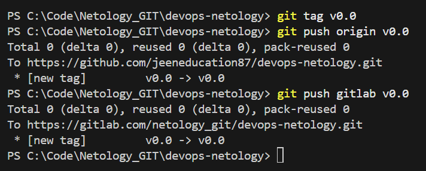
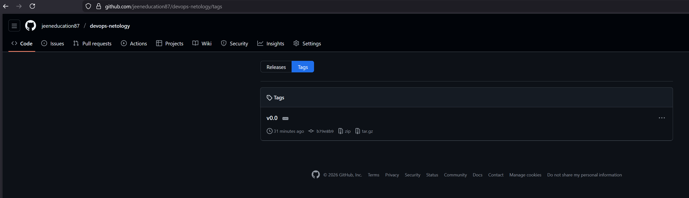
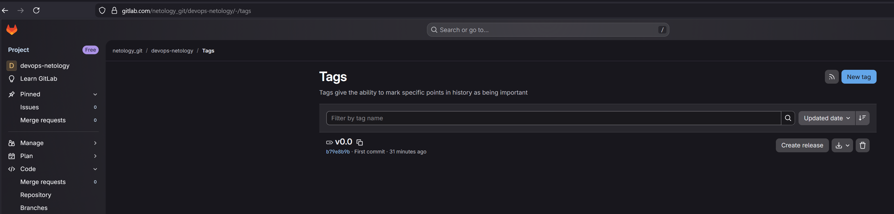

2. Аннотированный тег. Отправляем тег на оба сервера:
`git tag -a v0.1 -m "Annotation for v0.1"`
`git push origin v0.1`
`git push gitlab v0.1`

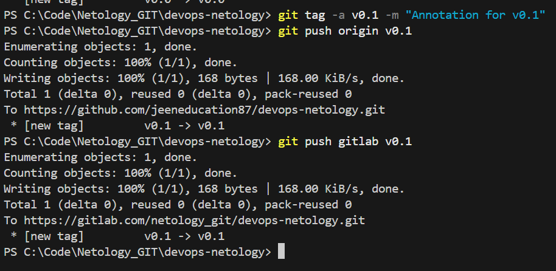
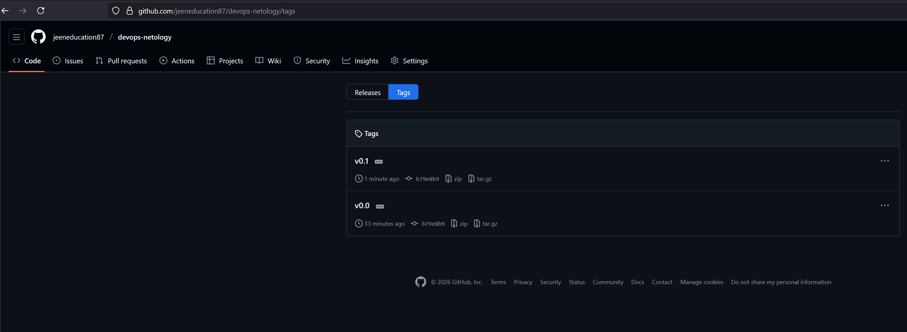
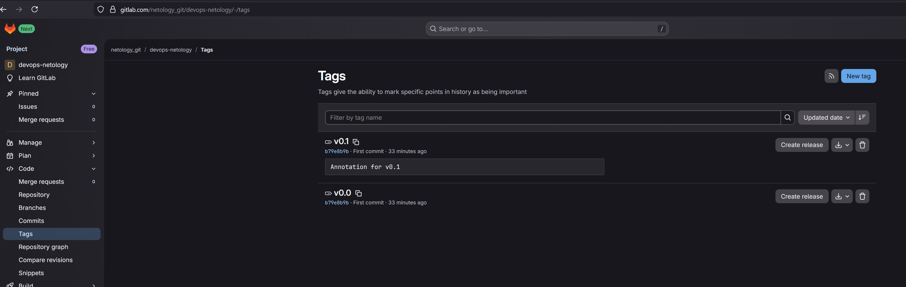

## Задание 3. Ветки 

Давайте посмотрим, как будет выглядеть история коммитов при создании веток. 

1. Переключитесь обратно на ветку `main`, которая должна быть связана с веткой `main` репозитория на `github`.
1. Посмотрите лог коммитов и найдите хеш коммита с названием `Prepare to delete and move`, который был создан в пределах предыдущего домашнего задания. 
1. Выполните `git checkout` по хешу найденного коммита. 
1. Создайте новую ветку `fix`, базируясь на этом коммите `git switch -c fix`.
1. Отправьте новую ветку в репозиторий на GitHub `git push -u origin fix`.
1. Посмотрите, как визуально выглядит ваша схема коммитов: https://github.com/YOUR_ACCOUNT/devops-netology/network. 
1. Теперь измените содержание файла `README.md`, добавив новую строчку.
1. Отправьте изменения в репозиторий и посмотрите, как изменится схема на странице https://github.com/YOUR_ACCOUNT/devops-netology/network 
и как изменится вывод команды `git log`.

## Решение 3. Ветки 

1. Создадим ветку fix и отправим её на GitHub:
`git switch -c fix`
`git push -u origin fix`

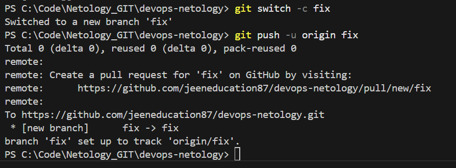

2. Внесем изменения:
`Add-Content README.md "New line for branch test"`
`git add .`
`git commit -m "Update README in fix branch"`
`git push`

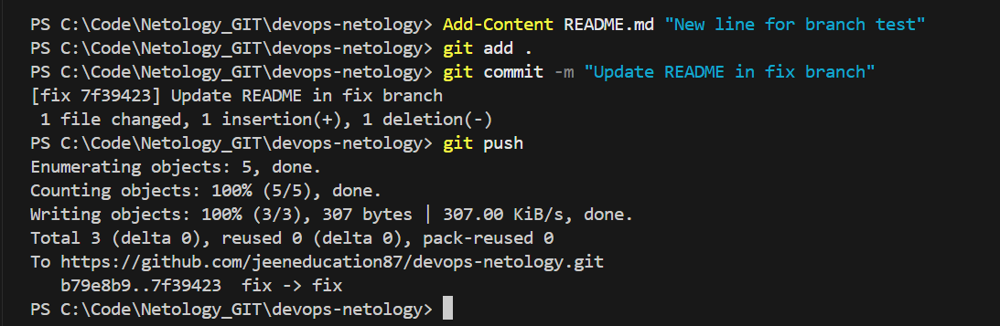

`git log --graph --all`

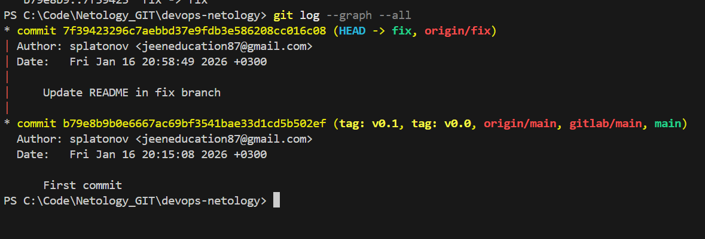

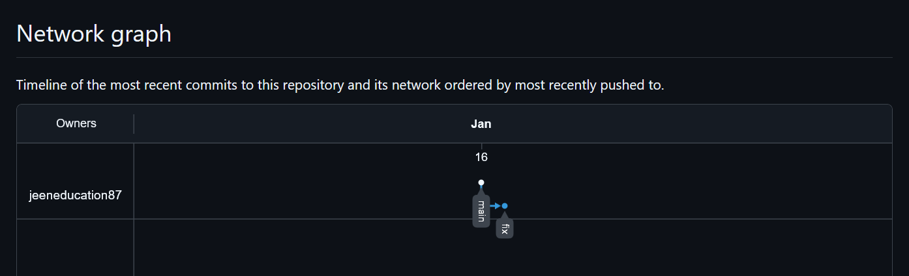

## Задание 4. Упрощаем себе жизнь

Попробуем поработь с Git при помощи визуального редактора. 

1. В используемой IDE PyCharm откройте визуальный редактор работы с Git, находящийся в меню View -> Tool Windows -> Git.
1. Измените какой-нибудь файл, и он сразу появится на вкладке `Local Changes`, отсюда можно выполнить коммит, нажав на кнопку внизу этого диалога. 
1. Элементы управления для работы с Git будут выглядеть примерно так:

   
   
1. Попробуйте выполнить пару коммитов, используя IDE. 

[По ссылке](https://www.jetbrains.com/help/pycharm/commit-and-push-changes.html) можно найти справочную информацию по визуальному интерфейсу. 

Если вверху экрана выбрать свою операционную систему, можно посмотреть горячие клавиши для работы с Git. 
Подробней о визуальном интерфейсе мы расскажем на одной из следующих лекций.

*В качестве результата работы по всем заданиям приложите ссылки на ваши репозитории в GitHub, GitLab.  
 

## Решение 4. Упрощаем себе жизнь

В моем случае использую VSCODE для удобства работы с репозиториями.
Добавим директорию в VSCODE в общее рабочее пространство, чтобы увидеть в UI.
File -> Add Folder to Workspace... -> C:\Code\GIT\devops-netology

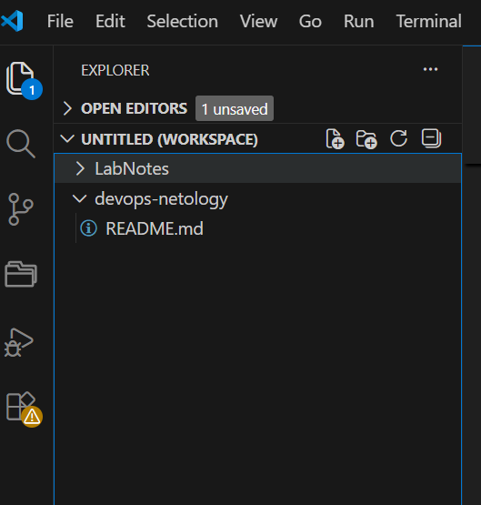

1. Нажимаем в VS Code Source Control (ветвистое дерево)
2. Изменяем файл README.md в директории devops-netology и сохраняем CTRL+S

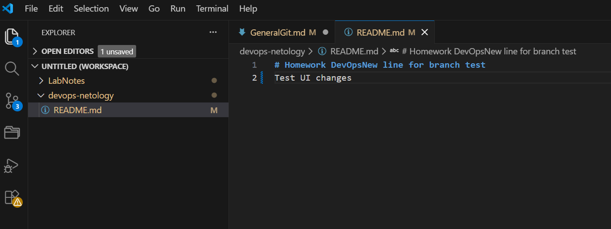

3. Файл README.md в списке изменений и помечем "М"

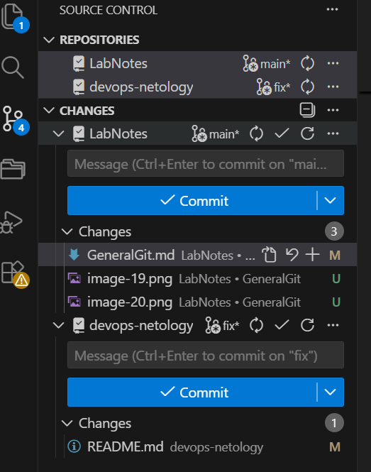

4. Нажимаем Commit&push

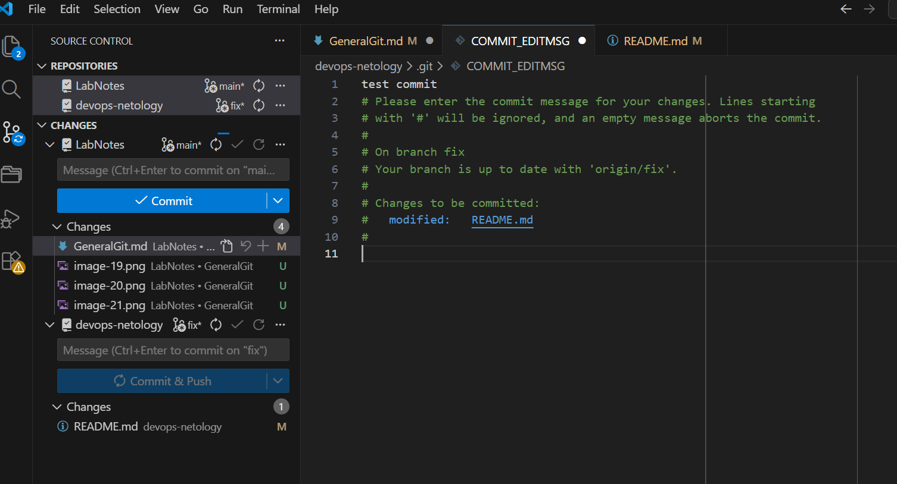

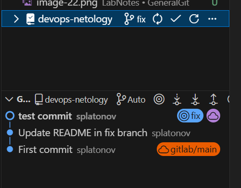

Ссылки на созданные в рамках работы репозитории: 
[GitHub](https://github.com/jeeneducation87/devops-netology/tree/main)
[GitLab](https://gitlab.com/netology_git/devops-netology/-/blob/main/README.md)

----

