# Домашнее задание к занятию  «Защита хоста»

### Задание 1

1. Установите **eCryptfs**.
2. Добавьте пользователя cryptouser.
3. Зашифруйте домашний каталог пользователя с помощью eCryptfs.

*В качестве ответа  пришлите снимки экрана домашнего каталога пользователя с исходными и зашифрованными данными.*  

### Решение 1

- Установка ecryptfs
`sudo apt update`
`sudo apt install ecryptfs-utils cryptsetup`

- Создаем пользователя для проверки выборочного шифрования
`sudo adduser cryptouser`
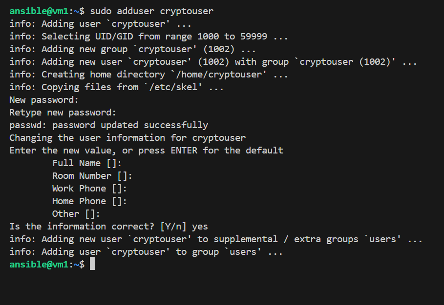

- Шифрование домашнего каталога
`sudo ecryptfs-migrate-home -u cryptouser`
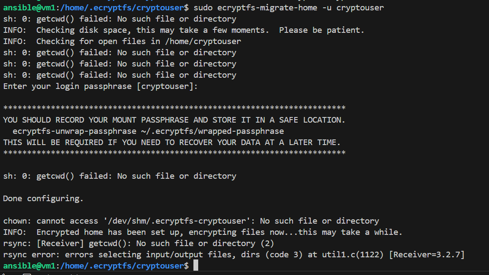
Нужно зайти под пользователем cryptouser сразу же после этой операции (до перезагрузки), чтобы завершить настройку (обернуть кодовую фразу).
`su - cryptouser`

- Создаем файл с текстом для тестирования шифрования
`echo "Это секретные данные" > secret.txt`
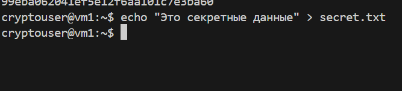

`ls -la`
`cat secret.txt`
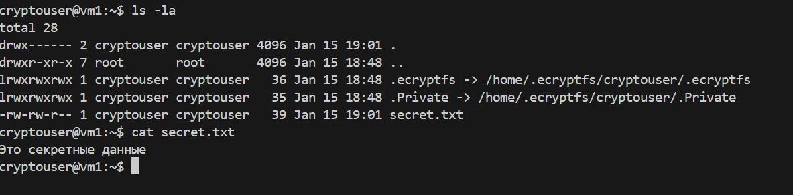

- Проверяем от имени другой учетной записи home директорию пользователя cryptouser

`exit`
`ls -la /home/cryptouser`
`sudo ls -la /home/.ecryptfs/cryptouser/.Private/`
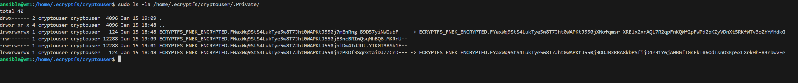
Наблюдаем листинг папки /home/.ecryptfs/cryptouser/.Private/, состоящий из зашифрованных имен файлов.

### Задание 2

1. Установите поддержку **LUKS**.
2. Создайте небольшой раздел, например, 100 Мб.
3. Зашифруйте созданный раздел с помощью LUKS.

*В качестве ответа пришлите снимки экрана с поэтапным выполнением задания.*

### Решение 2

- Установка LUKS

`sudo apt update`
`sudo apt install cryptsetup`
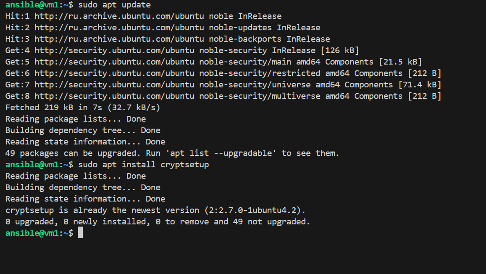

- Создание файла размером 100 Мб и подключение его как петлевое устройство (loop device).

`dd if=/dev/zero of=secret_volume.img bs=1M count=100`

`sudo losetup -fP secret_volume.img`

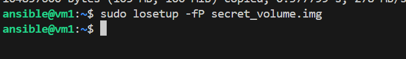

Узнаем имя устройства:
`losetup -a`

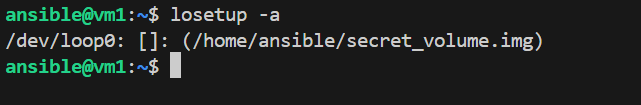

Запускаем форматирование в LUKS и задаем пароль:
`sudo cryptsetup luksFormat /dev/loop0`

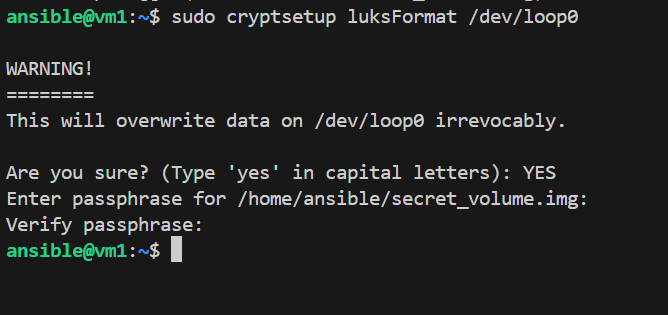

- Проверка работоспособности зашифрованного раздела
 
`sudo cryptsetup luksOpen /dev/loop0 my_secret_disk`
вводим пароль
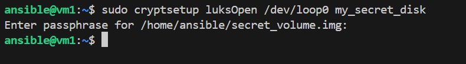

Создаем файловую систему на расшифрованном устройстве:
`sudo mkfs.ext4 /dev/mapper/my_secret_disk`
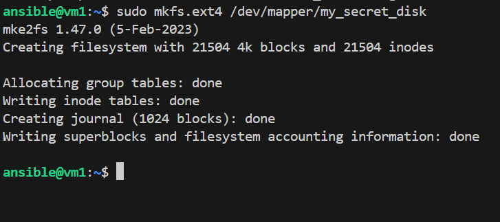

Создаем директорию и монтируем диск:
`sudo mkdir /mnt/secret_data`
`sudo mount /dev/mapper/my_secret_disk /mnt/secret_data`
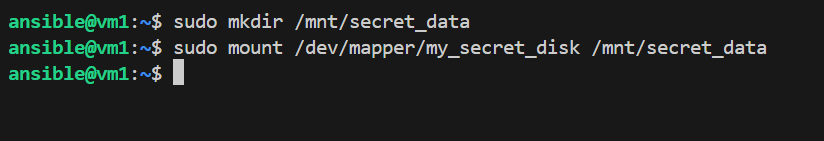

- Проверка статуса шифрования и наличие диска:
 
`sudo cryptsetup status my_secret_disk`
`df -h | grep secret`
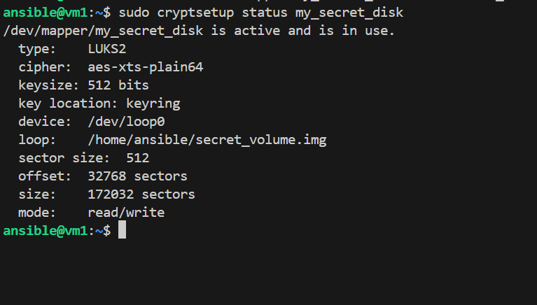
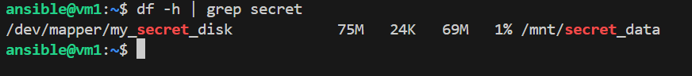
